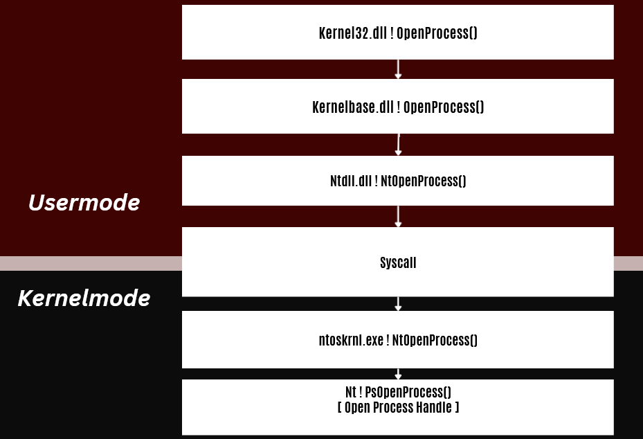
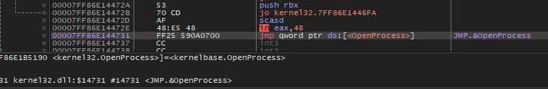
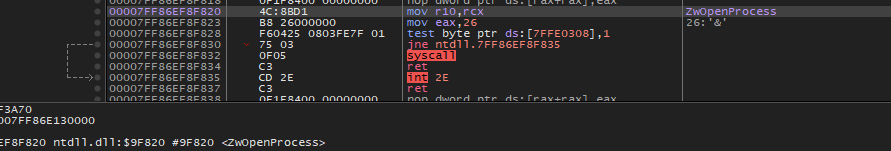
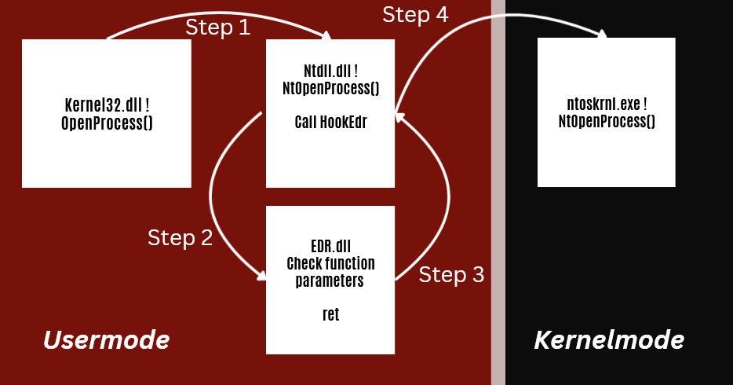

It is important to highlight that not all EDRs will contain all the components that will be mentioned below, this depends on the maturity of the software.

# Static scanner

An application, or a component within the agent, conducts static analysis on images, such as Portable Executable (PE) files or arbitrary segments of virtual memory, to ascertain if the content is malicious. Static scanners often serve as the foundation of antivirus services.

Some features of the scanner include YARA rule-based detections.

# Hooking DLL

The hooking DLL is a DLL that is loaded in all processes created on the machine from the EDR Kernel Driver, it is a very powerful detection measure. Consider previous modules such as ... and ... , these are techniques that evaded AVs, but alone would be easily detected by an EDR, as with EDR hooking it is capable of intercepting and analyzing parameters passed to the WinAPIs.

## Normal Flow OpenProcess:

OpenProcess flow from Kernel32.dll to Nt! PsOpenProcess() where is the actual function that retrieves the handle of the target process.

## Hooked Flow OpenProcess:

Step-by-step explanation, we will skip some steps that are irrelevant to our case, but using the Normal Flow example, you can understand it well:

- Step 1- Kernel32.dll ! OpenProcess arrives at Ntdll.dll which is hooked.
- Step 2 - The Ntdll.dll hook made by EDR.dll makes a redirection(in example with call instruction), changing the flow and thus being able to analyze the function parameters made in the API call to check if it is being used maliciously.
- Step 3 - If he concludes that it is not being used maliciously, he returns to normal flow (in example with ret instruction).
- Step 4 - Performs the syscall taking the call flow to kernelmode.

# Kernel Driver

A kernel mode driver is responsible for injecting the hooking DLL into target processes and collecting kernel-specific telemetry.

Kernel Callbacks represent one of the most powerful features of drivers in the context of EDRs, as they have the ability to be notified when a system event occurs. These events may include the creation or termination of new processes and threads, requests to duplicate processes and threads, loading images, performing actions in the registry, or requesting a system shutdown. For example, a EDR may want to know if a process is trying to open a new handle to lsass.exe, as this is a central component in most credential dumping techniques. To achieve this, the driver registers callback routines that essentially say to be notified when such an event occurs. As a result of these notifications, the driver can take action.

# Agent Service

An application tasked with consolidating telemetry generated by the preceding two components. It occasionally correlates data or generates alerts. Subsequently, it forwards the collected data to a centralized EDR server.

# Network Filter Drivers

At times, an EDR needs to develop its own sensor to gather telemetry data generated by specific system components, such as file system mini-filters in the Windows environment. This necessity extends to the network stack as well. A host-based security agent may find it essential to capture network telemetry for various reasons. Network traffic often serves as the primary vector for attackers to gain initial access to a system, such as through visits to malicious websites. Additionally, network traffic plays a crucial role in lateral movement, allowing attackers to traverse between hosts. Therefore, if an endpoint security solution aims to inspect and analyze network packets, it will likely require the implementation of a network filter driver. 

Often, this component is tasked with detecting Command and Control (C2) beaconing connections.

# Filesystem Filter Drivers

These drivers are valuable because they can observe an attacker's interaction, such as changes to the file system like placing malware on the disk. Often, they work in conjunction with other system components. Through integration with the agent's scanning mechanism, for instance, they can trigger the EDR to inspect files.

Mini-filters can naturally monitor the native Windows file system, known as the New Technology File System (NTFS), implemented in ntfs.sys. However, they can also monitor other critical file systems, including named pipes, a bidirectional inter-process communication mechanism implemented in npfs.sys, and mailslots, a unidirectional communication mechanism. 

# ETW Consumers

By leveraging Event Tracing for Windows (ETW), EDRs can be programmed within their applications to emit events, consume events from other components, and manage event tracing sessions. This capability enables them to trace the execution of their code and monitor or debug potential issues. It may be helpful to consider ETW as an alternative to printf-based debugging; messages are emitted through a common channel using a standardized format instead of being printed to the console.

# Observations

I haven't even talked about everything by far, but the objective here was just to introduce the complex functioning of an EDR and its component architecture so that we can continue with the next articles where we will talk strictly about Hooking DLL evasion.

