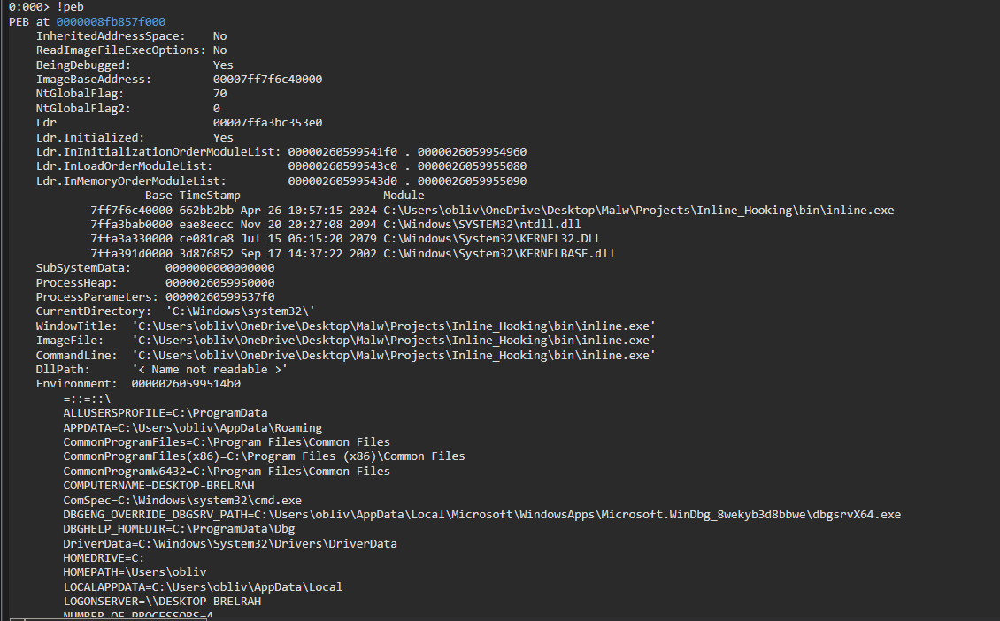
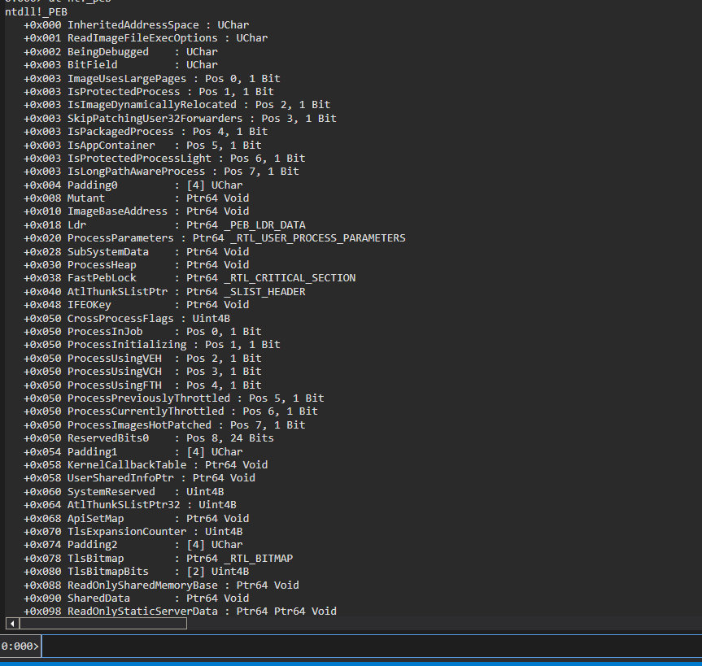
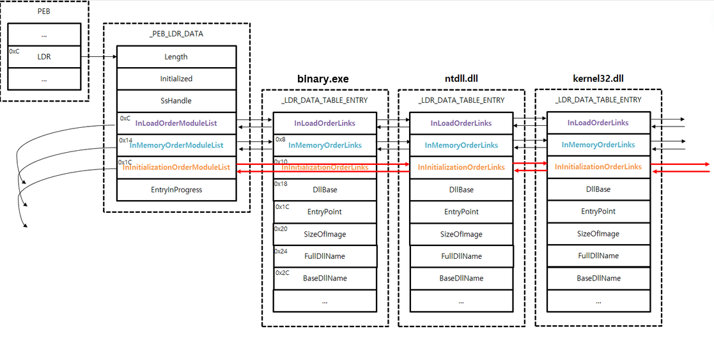
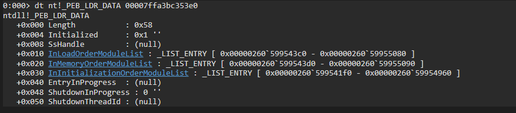
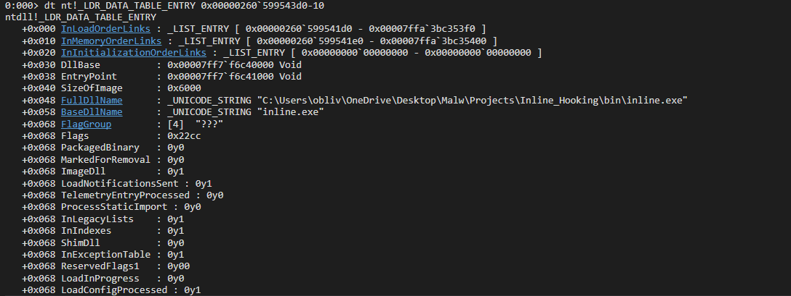
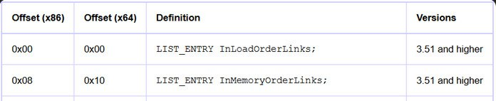

In this topic, I will provide a brief description of the four subsequent projects. I will start by explaining the shellcode in C, eventually demonstrating how to perform some of the implementations in Assembly. Each project will be divided into two parts: the C code and a simple loader to execute the shellcode. It's important to note that the developed shellcode needs to be ``position-independent code (PIC)``.

# Position Independent Code (PIC)

Position Independent Code (PIC) refers to code that is independent of the header and other sections besides the text section. It should be developed without using statically linked APIs and without global variables. Next, we extract its text section and save it in a ``.bin`` file for subsequent loading.

# Retrieving Module Address

First, lets start with an explanation of how this routine works. We will access the Process Environment Block (PEB). The PEB contains information about the process, including details like ``ProcessParameters``, ``CommandLine``, ``ImageFile``, and others. However, what matters to us is the ``Ldr``, which contain elements we need such as ``InLoadOrderModuleList``,  ``InMemoryOrderModuleList`` and it will be explained later.  

Well, to retrieve the [PEB]((https://ntdoc.m417z.com/peb)) address, I'll show you two straightforward methods. One is by directly fetching the offset ``0x60`` in the GS segment register in ``x86_64``, and in ``x86``, it would be ``0x30`` in the ``FS`` segment register. The second method involves accessing the [Thread Environment Block (TEB)](https://ntdoc.m417z.com/teb), where you can find the [PEB](https://ntdoc.m417z.com/peb) address. In ``x86_64`` systems, the [TEB](https://ntdoc.m417z.com/teb) is located at ``GS:0x30``.

In C, we have another alternative by using a binding like [NtCurrentTeb()](https://learn.microsoft.com/ms-my/windows/win32/api/winnt/nf-winnt-ntcurrentteb) which returns a struct [_TEB](https://ntdoc.m417z.com/teb), and we can access the field ProcessEnvironmentBlock. If you'd like to delve deeper into this topic, and I highly recommend it, visit [https://en.wikipedia.org/wiki/Win32_Thread_Information_Block](https://en.wikipedia.org/wiki/Win32_Thread_Information_Block).

Lets see in WinDbg how our ``Walk`` in the PEB would be until we reach the address of ``kernel32.dll``, with the command ``!peb`` we can have a good visualization of the structure.



We can observe that kernel32.dll is the third module loaded in the process because it lists in the loading order. ``Kernel32.dll`` expands to ``kernelbase.dll`` where all implementation is centralized; kernel32 only contains declarations, and the logic resides in another DLL, allowing Microsoft to alter it as desired. Every time an .exe is executed, it will always load ntdll first, followed by ``kernel32.dll`` and ``kernelbase.dll``. Knowing this, we can use this information to find it, as I will show next.

Now we will use the command ``dt nt!_peb`` (display type) to visualize the structure from another perspective, as they are basically structures within structures.



We see that Ldr is a structure called [_PEB_LDR_DATA](https://ntdoc.m417z.com/peb_ldr_data) which has the three elements I mentioned earlier, they are:

1. ``InLoadOrderModuleList`` – The order in which the modules(exes or dlls) get loaded
2. ``InMemoryOrderModuleList`` – The order in which the modules(exes or dlls) get stored in memory
3. ``InInitializationOrderModuleList`` – The order in which the modules(exes or dlls) get initialized within the process environment block.



The [_PEB_LDR_DATA](https://ntdoc.m417z.com/peb_ldr_data) leads us to an array of arrays structure called [_LDR_DATA_TABLE_ENTRY](https://ntdoc.m417z.com/ldr_data_table_entry), which contains very important information about the loaded modules such as ``DllBase``, which is the module's address, ``SizeOfImage``, which is the size of the image in memory, ``BaseDllName``, which is the name of the module, and others. Within ``InMemoryOrderModuleList`` and ``InLoadOrderModuleList``, there is the memory address of the next structure in the array. As mentioned earlier, the default loading order of modules follows a specific sequence, so ``kernel32.dll`` will be the third one.

In the first image, the address of [LDR](https://ntdoc.m417z.com/peb_ldr_data) was shown as ``00007ffa3bc353e0``, so we will proceed with the command ``dt nt!_PEB_LDR_DATA 00007ffa3bc353e0`` and we will get the following response.



With the address of the first array in hand, using this same address to access the [_LDR_DATA_TABLE_ENTRY](https://ntdoc.m417z.com/ldr_data_table_entry) structure, we will find the array corresponding to the first loaded module.



We need to pass the -10 because it is the offset of [LIST_ENTRY](https://learn.microsoft.com/en-us/windows/win32/api/ntdef/ns-ntdef-list_entry), as I will show in the following image.



And the next one will be kernel32.dll. Now, I will demonstrate a basic implementation of how to perform all these operations in NASM. I'll explain each line in the code comments and the text.

## LdrModuleAddr in NASM

```
section .text                    ; Define the text section
global _start                    ; Define the entry point

_start:                          ; Entry point
    xor rax, rax                 ; Clear the rax register for use
    mov rax, [gs:0x30]           ; Retrieve the address of TEB (Thread Environment Block)
    mov rax, [rax + 0x60]        ; Go to offset 0x60, where the PEB (Process Environment Block) is located within TEB
    mov rax, [rax + 0x18 - 0x10] ; Go to offset 0x18 where Ldr is located and subtract 0x10 which is the offset of LIST_ENTRY
    mov rax, [rax]               ; Load the first module
    mov rax, [rax]               ; Load the second module
    mov rax, [rax + 0x30]        ; Load the third module + offset of DllBase
```


You can perform a loop with a comparison of the module name (BaseDllName), and if successful, return the address of DllBase.


## LdrModuleAddr in C

```c
PVOID LdrModuleAddr( _In_ LPWSTR ModuleName ){

    PTEB                  pTeb  = __readgsqword(0x30);
    PLDR_DATA_TABLE_ENTRY Data  = { 0 };
    PLIST_ENTRY           Head  = { 0 };
    PLIST_ENTRY           Entry = { 0 };

    Head  = &pTeb->ProcessEnvironmentBlock->Ldr->InLoadOrderModuleList;
    Entry = Head->Flink;

    for ( ; Head != Entry ; Entry = Entry->Flink ) {
        Data = C_PTR( Entry );
        
        if (wccmp(Data->BaseDllName.Buffer, ModuleName) == 0) {
                    return (HMODULE)Data->DllBase;
        }
    }

    return NULL;
}
```

It's a very similar code, but here we apply a loop that compares the module name, and if it matches the one we input, its address will be returned via ``DllBase``. Here we had two options: to use _``_readgsqword(0x30)`` or [NtCurrentTeb()](https://learn.microsoft.com/ms-my/windows/win32/api/winnt/nf-winnt-ntcurrentteb) to populate the created instance of the structure.