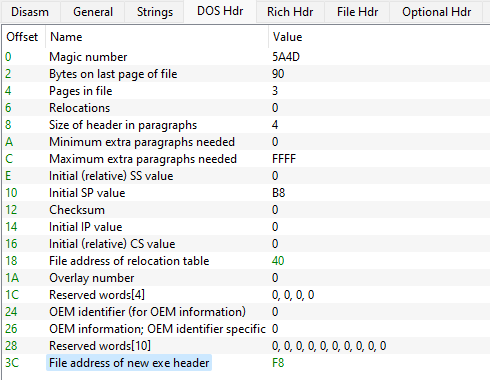
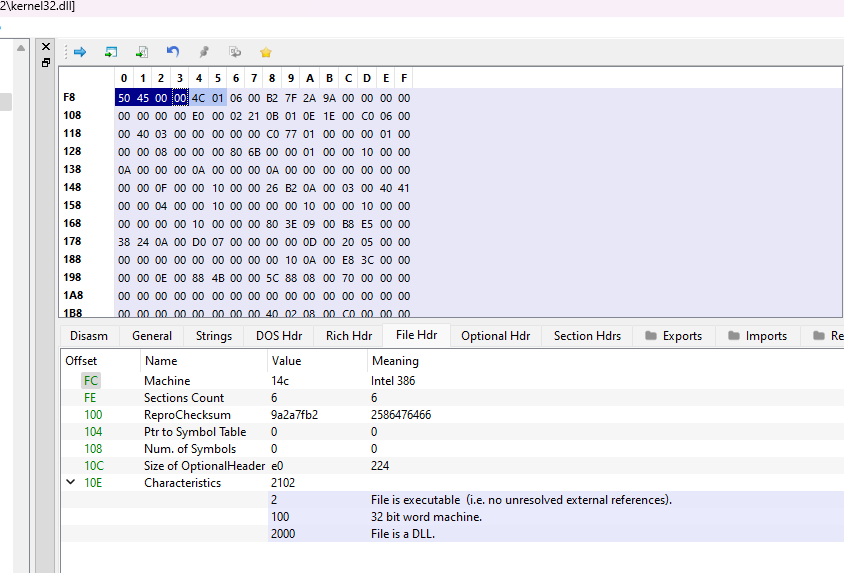
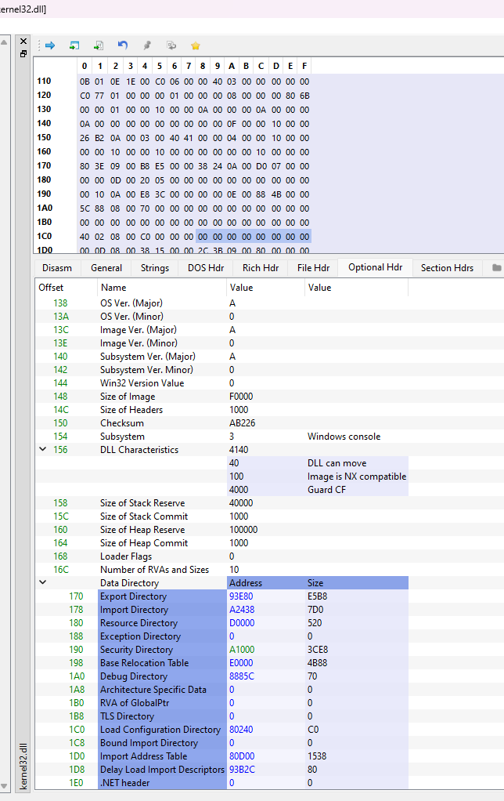
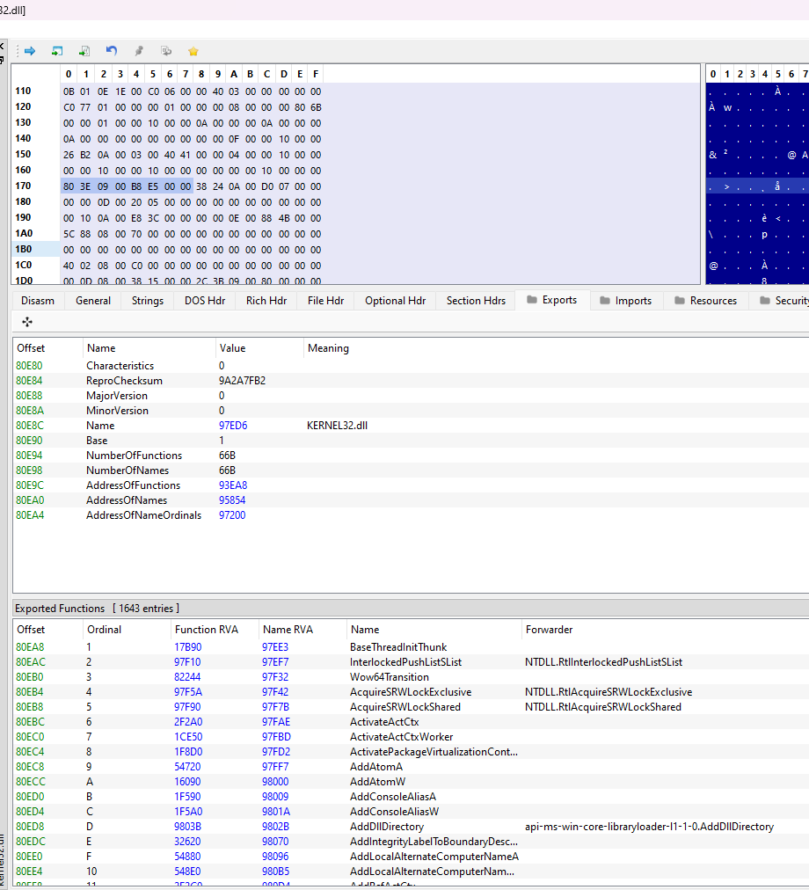

# Retrieving Export Function

Here, since we already have the address of the module (DLL) loaded into the process, we need to navigate through its PE structure, passing through the PE headers and reaching the data directory, where we will find the IMAGE EXPORT DIRECTORY. For a better understanding of the PE format, check the link: PE Format - Microsoft Documentation.

I will demonstrate the structure using PE-Bear after loading the DLL, but in general, the format looks like this:


Lets go to the first header called IMAGE DOS HEADER, which has the following structure. From there, we'll obtain the offset of the next header, known as the File Address of the new exe header, or e_lfanew.



This will take us to the IMAGE NT HEADERS where we have its signature PE00 equal to 504500 as I'll show next.



Inside the IMAGE NT HEADERS, we have the IMAGE FILE HEADER and the IMAGE OPTIONAL HEADER. What interests us here is the IMAGE OPTIONAL HEADER, as it contains the data directories where we can find the IMAGE EXPORT DIRECTORY, which is what we are interested in.



Now, in the IMAGE OPTIONAL HEADER, we can see that the EXPORT DIRECTORY is the first data directory. We can proceed to this directory and find components important for building our function.



Here we can already see the exported functions. To access them, we need three important components:

- AddressOfFunctions: Specifies the address of an array of addresses of the exported functions.
- AddressOfNames: Specifies the address of an array of addresses of the names of the exported functions.
- AddressOfNameOrdinals: Specifies the address of an array of ordinal numbers for the exported functions.

Ordinals are used to identify the address of the function, not the name.

## Steps for LdrFuncAddr

- Retrieve the address of IMAGE NT HEADERS using e_lfanew, which is the last Offset of IMAGE DOS HEADER.
- Access the IMAGE OPTIONAL HEADER within IMAGE NT HEADERS.
- Navigate to the data directory within IMAGE OPTIONAL HEADER, specifically to the first data directory which is the IMAGE EXPORT DIRECTORY, and retrieve its address.
- Access the components AddressOfNames,  AddressOfFunctions, and AddressOfNameOrdinals.
- Perform a loop searching for the input, which is the name of the exported function.

## LdrFuncAddr in ASM

```
section .text
global LdrFuncAddr

LdrFuncAddr:
    ; Receive parameters:
    ;   [ebp+8] - Module base address
    ;   [ebp+12] - Exported function name

    ; Save used registers
    push ebp
    mov ebp, esp

    ; Input parameters
    mov edi, [ebp+8]  ; Module base address
    mov esi, [ebp+12] ; Exported function name

    ; Get IMAGE DOS HEADER
    mov eax, [edi+0x3C]  ; Offset to e_lfanew
    add eax, edi         ; Address of IMAGE NT HEADERS

    ; Get IMAGE OPTIONAL HEADER
    add eax, 0x18        ; Offset to IMAGE OPTIONAL HEADER
    mov ebx, [eax]       ; Address of IMAGE OPTIONAL HEADER

    ; Get IMAGE EXPORT DIRECTORY
    add ebx, 0x60        ; Offset to export directory
    mov ecx, [ebx+0x1C]  ; Address of export directory
    add ecx, edi         ; Absolute address of export directory

    ; Get necessary components
    mov edx, [ecx+0x18]  ; Address of AddressOfNames
    add edx, edi         ; Absolute address of AddressOfNames
    mov esi, [ecx+0x1C]  ; Address of AddressOfNameOrdinals
    add esi, edi         ; Absolute address of AddressOfNameOrdinals
    mov edi, [ecx+0x20]  ; Address of AddressOfFunctions
    add edi, edi         ; Absolute address of AddressOfFunctions

search_loop:
    ; Get the next name from the name list
    mov eax, [edx]
    add eax, edi         ; Absolute address of function name

    ; Compare the current function name with the provided name
    ; If they match, find the address of the corresponding function
    cmp byte [eax], 0
    je not_found
    mov ecx, esi         ; Address of AddressOfNameOrdinals
    mov eax, [ecx]       ; Address of the function's ordinal
    add eax, edi         ; Absolute address of the function's ordinal
    mov ebx, [edi+eax*4] ; Address of AddressOfFunctions
    add ebx, edi         ; Absolute address of AddressOfFunctions
    mov eax, [ebx+eax*4] ; Address of the exported function
    add eax, edi         ; Absolute address of the exported function
    ret

not_found:
    ; Move to the next name in the list
    add edx, 4
    add esi, 2
    jmp search_loop
```

## LdrFuncAddr in C

```c
PVOID LdrFuncAddr( _In_ PVOID BaseModule, _In_ PCHAR FuncName){
    
    PIMAGE_NT_HEADERS       pImgNt           = { 0 };
    PIMAGE_EXPORT_DIRECTORY ExpDir           = { 0 };
    DWORD                   ExpDirSz         = { 0 };
    PDWORD                  AddrOfFuncs      = { 0 };
    PDWORD                  AddrOfNames      = { 0 };
    PWORD                   AddrOfOrdinals   = { 0 };
    PVOID                   FuncAddr         = { 0 };

    pImgNt           = C_PTR( BaseModule + ((PIMAGE_DOS_HEADER)BaseModule)->e_lfanew);
    ExpDir           = C_PTR( BaseModule + pImgNt->OptionalHeader.DataDirectory[ IMAGE_DIRECTORY_ENTRY_EXPORT ].VirtualAddress );
    ExpDirSz         = U_PTR( BaseModule + pImgNt->OptionalHeader.DataDirectory[ IMAGE_DIRECTORY_ENTRY_EXPORT ].Size );

    AddrOfNames      = C_PTR( BaseModule + ExpDir->AddressOfNames );
    AddrOfFuncs      = C_PTR( BaseModule + ExpDir->AddressOfFunctions );
    AddrOfOrdinals   = C_PTR( BaseModule + ExpDir->AddressOfNameOrdinals );

    for ( int i = 0; i < ExpDir->NumberOfNames; i++ ){    
      if ( StringCompareA( (PCHAR)BaseModule + AddrOfNames[ i ], FuncName ) == 0 ) {
        return C_PTR( BaseModule + AddrOfFuncs[ AddrOfOrdinals[ i ] ] );
      }
    }

    return NULL;
}
```