# Import Address Table (IAT)

The Import Address Table(IAT), consists of the API imports used within a binary. For instance, in a previous article in this journal, we demonstrated how to detect Classic Injection which is a classic injection. We could already consider it malicious simply by its IAT, as this somewhat reveals its actions, typically used by malware. However, now I will show ways to use WinAPIs while keeping the IAT clean.

# Dynamic Calls

When we compile our binary by importing <Windows.h>, we are already telling the compiler that we will use these functions. The compiler automatically loads the Dynamic Linked Library (DLL) and adds the WINAPI call to the PE structure.

One solution is to make the call dynamically. This occurs as follows: if the DLL is already incorporated into the process, we will use GetModuleHandle to obtain an identifier for the DLL. If it is not incorporated, we will use LoadLibrary to load it into the process and obtain the identifier.

```c
typedef int(WINAPI *pMessageBox)(
    HWND hWnd,
    LPCSTR lpText,
    LPCSTR lpCaption,
    UINT uType
);
```

And then we will retrieve the address of the exported function by populating a previously defined structure. In the case of MessageBox, it is exported from the DLL called User32.dll, and for that, it needs to be loaded into the process, so we use LoadLibrary.

```c
HMODULE hUser32 = LoadLibraryA( "user32.dll" );
pMessageBox ppMessageBox = GetProcAddress( hUser32, "MessageBoxA" );
ppMessageBox( NULL, "Dynamically Called MessageBox", "Dynamic Call :D", MB_OK );
```

Comparing the difference in the Import Address Table (IAT) between a binary with dynamic and static loading:

### Static

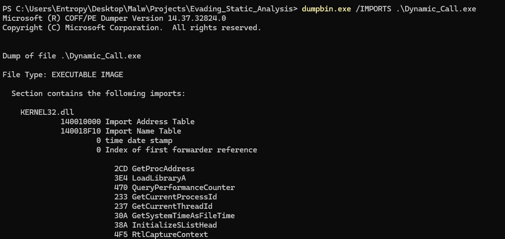

### Dynamic

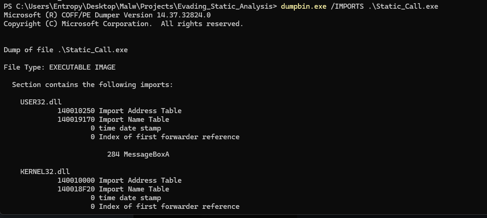

That was a demonstration using Dumpbin.exe. There are other tools such as: CFF Explorer, PEID, PEView, DIE and more. Now I will show the difference in the disassembly.

### Static

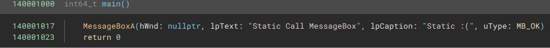

As we can see above, we were able to receive the information for each parameter and its value.

### Dynamic

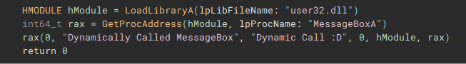

This time, we don't have exactly the same parameters and their values, but GetProcAddress and LoadLibrary are visible. We pass "user32.dll" and "MessageBox" as parameters.

By doing this, we hide the import of User32.dll and the API used. However, there are still two other points that can be improved upon. If we look closely at Dynamic, it is showing the use of GetProcAddress and LoadLibrary, which is not good.

Now, another demonstration, but this time using custom APIs, meaning my own implementation.

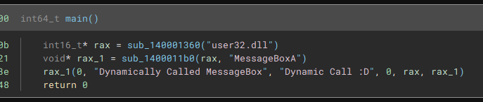

Here we have a quite significant difference, this way, we won't have the import of dynamic loading APIs, and we only have issues with the strings, which make it very obvious what is happening. I won't delve into the creation of the APIs, but you can study the [Source Code]. 

When it comes to strings, there's something called String Hashing, where it's possible to pass a hash instead of the string when calling our custom API. It's an additional feature, and I leave reference for more informations [API Hashing](https://www.ired.team/offensive-security/defense-evasion/windows-api-hashing-in-malware).

For more information about WINAPI used in malware and its purposes, I recommend visiting [MalApi](https://malapi.io/)

# Signature

Signature evasion is crucial when we want to create a loader for a Command and Control (C2) and establish a reverse connection. It's also essential for running Mimikatz in an evasive manner, among other operations. However, the challenge lies in the bytecodes we choose to use. In almost 100% of cases, these tools will have a signature, which means we can't simply drop the .bin file into our malware and run the loader. To address this issue, there are methods we can employ, and I'll show a bit about them.

## Cryptography | Obfuscation 

One way, somewhat like a signature, is encrypting your payload or obfuscating it. This way, you won't be caught by signature-based detection. There are various algorithms that can be used, such as Salsa20, Serpent, 3DES, AES, XOR, RC4, and more. For obfuscation, we have IPv4, IPv6, and MAC. You can find a tool that generates output with obfuscation called HellShell, developed by NUL0x4C. He and mrd0x are references in Maldev and recommend that you follow them. Obfuscation has a certain advantage because it does not increase the entropy of the binary, but caution must be taken with the algorithm used.

Returning to our discussion on cryptography and obfuscation, I will talk about cryptography, explaining the various ways it can be utilized. Well, there are several ways to detect cryptography in the binary, which is attributed to static analysis on entropy and reverse engineering analysis. I will delve into two topics at the moment:

- With WinAPI 
- Without WinAPI

### With WinAPI

Certainly, it is the easiest method to be identified. For encryption, there is the Windows CryptAPI, within which there are two functions called CryptGenKey and CryptCreateHash used for creating keys and hashes for encryption, decryption, and hash operations. In these two functions, there is a parameter called ALG_ID which is the key to detecting the encryption used, representing the ID of the algorithm being used. You can find more information about the ALG_ID in the Microsoft Documentation.

- CryptGenKey: Used to generate a cryptographic session key or a public/private key pair. You need to specify the algorithm you want to use for the key generation by passing the corresponding ALG_ID.

```c
ALG_ID algorithmID = CALG_AES_256;  // Example: AES with a 256-bit key
CryptGenKey( hCryptProv, algorithmID, 0, &hKey );
```

- CryptCreateHash: Used to create a new hash object, which is used to generate a hash value for data. You also need to specify the desired hash algorithm using the ALG_ID.

```c
ALG_ID algorithmID = CALG_SHA_256;  // Example: SHA-256
CryptCreateHash( hCryptProv, algorithmID, 0, 0, &hHash );
```

Therefore, the use of WinAPI for payload encryption should be avoided. So even with dynamic loading, it's not advisable and can still be detected, as I showed above in Import Address Table(IAT).

### Without WinAPI

Within this topic, we will have two ways in which encryption can be detected: Flow and Constants.

Constants -  Typically hardcoded values required in order to output the correct data - easy to detect. Constants range from substitution boxes, "magic numbers", or even just certain values used for mathematical operations.

Flow - Much harder to recognize, requires prior knowledge of the algorithm - although there are certain exception. Examples of recognizable flows: RC4 KSA, PRGA, XOR stages, length of the Serpent CBC algorithm.

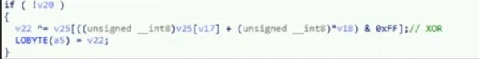

An example is XOR, represented in the image above. Even if you hardcode the algorithm in your code, it will be detected because of the Flow, so it's good to implement some changes to not make it so obvious. For instance, running it through VirusTotal will already detect the XOR.

## Stager

In addition to encryption, another approach is to make a call to the bytecodes in a file hosted on a web server. The file doesn't necessarily need to have the extension ".bin"; you can use any extension since we are only extracting bytes from the file. A crucial note to keep in mind is to be cautious of security solutions that perform traffic analysis, as the request can still be detected. Therefore, it is advisable to keep the payload encrypted and decrypt it during runtime.

As an example, I will simply direct you to Shellcode Injection. In the 'Attacker Perspective' section, there is a sample code that does what was mentioned here.

# Entropy

Entropy occurs when we have "random/disordered" data, usually happening when the data is packed or encrypted. This randomness is analyzed by an algorithm we won't delve into. The calculation of entropy can be checked in various ways, and the ideal is to have the calculation for each section of the PE (Portable Executable). I will show how to store the payload in .text and .rdata section and how this affects the binary's entropy. An important note is, entropy above 6.0 is a bad sign for us, the score ranges from 0 to 10.

## .text section

To place the payload inside the .text section, it is necessary to declare it to the compiler (MSVC) as follows:

```c
#pragma section(".text")
__declspec(allocate(".text")) <var type> <var name> =
```

for mingw-w64-gcc is:

```c
__attribute__((section(".text"))) <var type> <var name> =
```

Now the payload outside the .text section, then allocated in the .text encrypted and decrypted (brute shellcode).

### Outside the .text section.

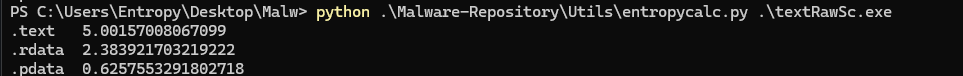

### Decrypted in the .text section.

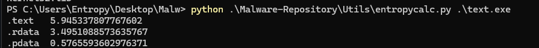

### Crypted in the .text section.

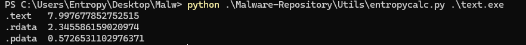

The raw shellcode in the code increases entropy if it is too large, this should be taken into consideration. Next, I will use the encrypted payload for the remaining sections.

## .rdata section

To allocate the load in the .rdata section, which is read-only data, it is necessary to declare a constant as follows.

```c
const unsigned char pPayloadBytes[] =
```

Now a sample of the entropy.


## Binary Entropy Reduction

A good way to avoid being flagged for entropy is to use options like Stage, inserting English strings into the binary and filling the encrypted payload text with the same byte repeatedly. This works because these added bytes will have an entropy of 0.00, as they are all the same. Removing the CRT Lib, as will be shown in the next topic, also helps reduce entropy.

For ease, there is a tool called Entropy Reducer that I recommend checking out.

# Compilation
In compilation, it's ideal to have some care, as depending on how it's done, there will be a lot of 'garbage', unnecessary things that will hinder your evasion. Below is a list of what we should do:

```bash
x86_64-w64-mingw32-gcc -s -w -mwindows -nostdlib -Os -fno-asynchronous-unwind-tables -masm=intel blackout.c -o blackout.exe
```

- -s: This flag is generally used to remove debugging symbols from the generated object code. This can help reduce the size of the final executable.

- -w: This flag is used to disable warnings during compilation. Warnings are messages that the compiler emits to indicate potential issues in the code, such as unused variables or suspicious operations.

- -mwindows: This flag is specific for compiling as a GUI, so it will not generate a console.

- -nostdlib: This flag instructs the compiler not to include the standard library (such as libc in the case of C) during linking.

- -Os: This flag optimizes the code for size. It instructs the compiler to try to reduce the size of the generated code, even if this may result in a slight loss of performance.

- -fno-asynchronous-unwind-tables: This flag disables the generation of asynchronous unwind tables. These tables are used to track the execution stack during exceptions or errors but can increase the size of the code.

- -masm=intel: This flag instructs the compiler to generate assembly code in the Intel format instead of the default GCC format.

- -o flag is used to specify the output file name for the compiled program or object file.

## Example

The same code will be compiled in two different ways. Payload compiled with cl blackout.c.

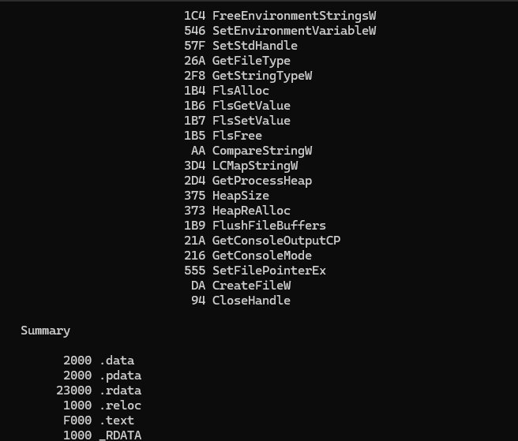

Payload compiled with the demonstrated implementations.

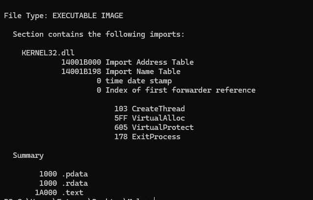

# Conclusion
Various static analysis prevention techniques were shown, consequently evading, we went through encryption, entropy, staging, dynamic calls, and even compilation.

