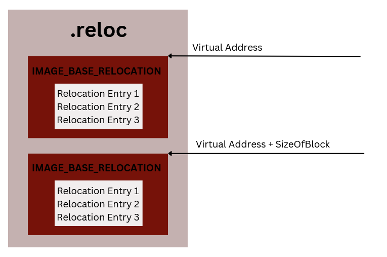
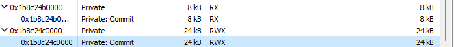
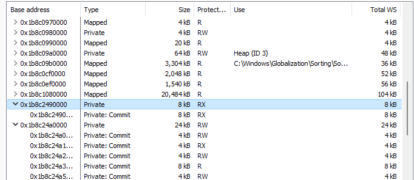

# What is Reflective DLL Injection

Reflective DLL Injection is nothing more than a way to load a DLL directly into the memory of the target process (which can also be the current process) instead of loading it using the LoadLibrary WinAPI, which utilizes the Windows DLL Loader. We will build an exported function that will perform all the reflective loader passes to execute our DllMain entrypoint.

# Reflective DLL Injection x Windows DLL Loader

| **Reflective DLL Injection**                     | **Windows DLL Loader**                     |
|--------------------------------------------------|--------------------------------------------|
| Does not trigger kernel callbacks for image loads| Triggers Kernel Callbacks for Image Loads  |
| Can be obfuscated                                | Cannot be obfuscated                       |
| Cannot be found through the Process Environment Block (PEB) | Can be found through the Process Environment Block (PEB) |
| The file does not need to be on disk             | The file needs to be on disk               |

# Requirements

To ensure reflective loading and make the DLL position-independent, several crucial steps must be taken. These include resolving/correcting the Relocation Table, the Import Address Table. However, we face a problem where we might leave Indicators of Compromise (IOCs) because when allocating memory for the DLL, we would have to use memory with RWX (Read-Write-Execute) permissions, and potentially have issues with TLS (Thread Local Storage) Callbacks. Therefore, I have added 2 more steps to this chapter on Reflective PE, its the memory protections of the sections, and executing the TLS Callbacks. Another consideration is that in the exported function, we cannot use WinAPI directly. All WinAPI functions must be resolved using ... and ... , as the Import Address Table has not yet been resolved.

# Upgrade in dynamic syscall
For this project, I've decided to upgrade the dynamic loading functions I mentioned earlier, so I've added support for forwarded functions, example of the fowarded function can be found here ...

## LdrFuncAddr

```c

PVOID LdrFuncAddr( 
    _In_ PVOID BaseModule, 
    _In_ PSTR FuncName 
) {
    PIMAGE_NT_HEADERS       pImgNt         = { 0 };
    PIMAGE_EXPORT_DIRECTORY pImgExportDir  = { 0 };
    DWORD                   ExpDirSz       = 0x00;
    PDWORD                  AddrOfFuncs    = NULL;
    PDWORD                  AddrOfNames    = NULL;
    PWORD                   AddrOfOrdinals = NULL;
    PVOID                   FuncAddr       = NULL;

    pImgNt          = C_PTR( BaseModule + ((PIMAGE_DOS_HEADER)BaseModule)->e_lfanew );
    pImgExportDir   = C_PTR( BaseModule + pImgNt->OptionalHeader.DataDirectory[IMAGE_DIRECTORY_ENTRY_EXPORT].VirtualAddress );
    ExpDirSz        = U_PTR( BaseModule + pImgNt->OptionalHeader.DataDirectory[IMAGE_DIRECTORY_ENTRY_EXPORT].Size );

    AddrOfNames     = C_PTR( BaseModule + pImgExportDir->AddressOfNames );
    AddrOfFuncs     = C_PTR( BaseModule + pImgExportDir->AddressOfFunctions );
    AddrOfOrdinals  = C_PTR( BaseModule + pImgExportDir->AddressOfNameOrdinals );

    for ( int i = 0 ; i < pImgExportDir->NumberOfNames ; i++ ) {
        PCHAR pFuncName         = (PCHAR)( BaseModule + AddrOfNames[i] );
        PVOID pFunctionAddress  = C_PTR( BaseModule + AddrOfFuncs[AddrOfOrdinals[i]] );

        if ( StringCompareA( pFuncName, FuncName ) == 0 ) {
            if (( U_PTR( pFunctionAddress ) >= U_PTR( pImgExportDir ) ) &&
                ( U_PTR( pFunctionAddress )  < U_PTR( pImgExportDir ) + ExpDirSz )) {

                CHAR  ForwarderName[MAX_PATH] = { 0 };
                DWORD dwOffset                = 0x00;
                PCHAR FuncMod                 = NULL;
                PCHAR nwFuncName              = NULL;

                MemCopy( ForwarderName, pFunctionAddress, StringLengthA( (PCHAR)pFunctionAddress ) );

                for ( int j = 0 ; j < StringLengthA( (PCHAR)ForwarderName ) ; j++ ) {
                    if (((PCHAR)ForwarderName)[j] == '.') {
                        dwOffset         = j;
                        ForwarderName[j] = '\0';
                        break;
                    }
                }

                FuncMod    = ForwarderName;
                nwFuncName = ForwarderName + dwOffset + 1;

                char  cLoadLibraryA[] = { 'L', 'o', 'a', 'd', 'L', 'i', 'b', 'r', 'a', 'r', 'y', 'A', 0 };
                WCHAR wKernel32[]     = { L'K', L'E', L'R', L'N', L'E', L'L', L'3', L'2', L'.', L'D', L'L', L'L', 0 };

                fnLoadLibraryA pLoadLibraryA = LdrFuncAddr(LdrModuleAddr(L"KERNEL32.DLL"), cLoadLibraryA );

                HMODULE hForwardedModule = pLoadLibraryA(FuncMod);
                if ( hForwardedModule ) {
                    if ( nwFuncName[0] == '#' ) {
                        int ordinal = (INT)( nwFuncName + 1 );
                        return (PVOID)LdrFuncAddr( hForwardedModule, (LPCSTR)ordinal );
                    } else {
                        return (PVOID)LdrFuncAddr( hForwardedModule, nwFuncName );
                    }
                }
                return NULL;
            }

            return C_PTR( pFunctionAddress );
        }
    }

    return NULL;
}
```

# Steps for Reflective Loader

- Get DLL Base Address
- Allocate memory to store the DLL. 
- Copy the DLL sections to the allocated memory. 
- Resolve relocations.
- Correct the Import Address Table.
- Re-Define memory permissions
- Execute TLS Callbacks. 
- Execute the EntryPoint (DllMain).

## Get DLL Base Address
It is necessary to obtain the base address from where the Reflective DLL was injected because we need to parse the PE header for subsequent activities, there are several ways to do this but for now we will use the simplest way which is getting the return address from the stack and looping looking for the magic bytes, a demonstration of the code below:

```
section .text

global RDIcaller

RDIcaller:
       call pop
       pop:
       pop rcx                  
   loop:
       xor rbx, rbx
       mov ebx, 0x5A4D
       dec rcx
       cmp bx,  [ rcx ]
       jne loop
       xor rax, rax
       mov ax,  [ rcx + 0x3C ]
       add rax, rcx
       xor rbx, rbx
       add bx,  0x4550
       cmp bx,  [ rax ]
       jne loop
       mov rax, rcx
   ret
```

## Memory Allocation

First and foremost, we'll allocate memory for our Reflective DLL. We'll use the VirtualAlloc WinAPI, passing the size of the image (SizeOfImage). Then, we'll use multiple memcpy operations in a loop to copy the data of sections to the allocated memory.

```c
DllAddr = pVirtualAlloc( NULL, pImgNtHdrs->OptionalHeader.SizeOfImage, 0x3000, 0x4);

for ( int i = 0 ; i < pImgNtHdrs->FileHeader.NumberOfSections; i++ ){
    MemCopy(
        C_PTR(DllAddr + pImgSectHdr[i].VirtualAddress),
        C_PTR(LibAddr + pImgSectHdr[i].PointerToRawData),
        pImgSectHdr[i].SizeOfRawData
    );
}
```

## Fix Relocation

This is necessary because all these resources rely on our DLL being loaded at the ImageBase (also known as the preferred address), which is a member of the Optional Header. Relocation Table is located in .reloc section. However, when loaded into a process, it will be allocated to a different memory space. Therefore, to find the new preferred address, we must use (ImageBase - Allocation Address). 

```c
dwOffset = DEREF_64(DllAddr) - pImgNtHdrs->OptionalHeader.ImageBase;
```

Now we need to obtain the virtual address of the Base Relocation Table. We can access it directly through the VirtualAddress field of the Optional Header, via Optional Header -> Data Directory[x], where x represents the index of the data directory array corresponding to BASE RELOC. However, a more elegant way to do this is by using the IMAGE_DIRECTORY_ENTRY_BASERELOC macro, as demonstrated below.

```c
pEntryReloc = &pImgNtHdrs->OptionalHeader.DataDirectory[IMAGE_DIRECTORY_ENTRY_BASERELOC];
```

The relocation table consists of blocks of IMAGE_BASE_RELOCATION, as shown below in the structure:

```c
typedef struct _IMAGE_BASE_RELOCATION {
    DWORD   VirtualAddress;	
    DWORD   SizeOfBlock;	
} IMAGE_BASE_RELOCATION, *PIMAGE_BASE_RELOCATION;
```

We can iterate over these blocks by taking the VirtualAddress + SizeOfBlock, an image below will be used to represent:



Relocation Entry is a BASE_RELOCATION_ENTRY structure where we will apply relocations:

```c
typedef struct _IMAGE_RELOCATION_ENTRY {
    WORD Offset : 12;
    WORD Type : 4;
} IMAGE_RELOCATION_ENTRY;
```

There are several Base Relocation Types, and we will perform relocation corrections on the main ones, which are:

| **Name**                         | **Value** | **Description**                                                                                           |
|-----------------------------------|-----------|-----------------------------------------------------------------------------------------------------------|
| IMAGE_REL_BASED_ABSOLUTE          | 0x00      | The base relocation adds the high 16 bits of the difference to the 16-bit field at offset. The 16-bit field.|
| IMAGE_REL_BASED_HIGH              | 0x01      | The base relocation adds the high 16 bits of the difference to the 16-bit field at offset.                 |
| IMAGE_REL_BASED_LOW               | 0x02      | The base relocation adds the low 16 bits of the difference to the 16-bit field at offset. The 16-bit field represents the low half of a 32-bit word. |
| IMAGE_REL_BASED_HIGHLOW           | 0x03      | The base relocation applies all 32 bits of the difference to the 32-bit field at offset.                   |
| IMAGE_REL_BASED_DIR64             | 0x010     | The base relocation applies the difference to the 64-bit field at offset.                                  |

Now, a code demonstration that performs the entire relocation process:

```c
BOOL FixReloc( 
    _In_ PIMAGE_DATA_DIRECTORY pEntryReloc, 
    _In_ PVOID                 NewImgAddr, 
    _In_ DWORD64               DeltaOffset 
) {

    PVOID                   FirstRelocBlock =  NULL;
    PIMAGE_BASE_RELOCATION  CurRelocBlock   = { 0 };
    PIMAGE_RELOCATION_ENTRY RelocEntry      = { 0 }; 
    DWORD64                 RelocRVA        =   0  ;
    DWORD64                 *RelocAddr      =   0  ;

    FirstRelocBlock = ( NewImgAddr + pEntryReloc->VirtualAddress );
    CurRelocBlock   = FirstRelocBlock;

    while( CurRelocBlock->VirtualAddress != NULL ){

        RelocEntry = &CurRelocBlock[1];

        while( (DWORD64)RelocEntry < (DWORD64)CurRelocBlock + CurRelocBlock->SizeOfBlock ){
            
            RelocRVA   = CurRelocBlock->VirtualAddress + RelocEntry->Offset;
            *RelocAddr = NewImgAddr + RelocRVA;

            switch(RelocEntry->Type){
                case IMAGE_REL_BASED_HIGH:
                    // 16 high bits
                    *RelocAddr += HIWORD(DeltaOffset);
                    break;
                case IMAGE_REL_BASED_LOW:
                    // 16 low bits
                    *RelocAddr += LOWORD(DeltaOffset);
                    break;
                case IMAGE_REL_BASED_HIGHLOW:
                    // 32 bits
                    *RelocAddr += (DWORD)DeltaOffset;
                    break;
                case IMAGE_REL_BASED_DIR64:
                    // 64 bits
                    *RelocAddr += DeltaOffset;
                    break;
                default:
                    break;
    		}  

            RelocEntry++;
        }

        CurRelocBlock = (PBYTE)CurRelocBlock + CurRelocBlock->SizeOfBlock;
    }

    return TRUE;

}
```

## Correcting IAT

Its necessary correct the Import Address Table because when the Windows DLL Loader loads the DLL into a process, it already fills the IAT with addresses of the functions used by the PE. However, since we're injecting the DLL into the memory of a process, we need to do this same work manually. The Import Directory Table is located in the idata section and has an array of IMAGE_IMPORT_DESCRIPTOR represented by the following structure:

```c
typedef struct _IMAGE_IMPORT_DESCRIPTOR {
    union {
        DWORD   Characteristics;
        DWORD   OriginalFirstThunk;
    } DUMMYUNIONNAME;
    DWORD   TimeDateStamp;
    DWORD   ForwarderChain;
    DWORD   Name;
    DWORD   FirstThunk;
} IMAGE_IMPORT_DESCRIPTOR;
```

- Name - DLL name that will be used as a parameter to get the module address.
- FirstThunk - Structure where we will fill in the addresses of the functions.
- OriginalFirstThunk -  Structure that we will use to get the name/ordinal of the functions.

The structure of FirstThunk and OriginalFirstThunk is IMAGE_THUNK_DATA, which will be demonstrated below:

```c
BOOL ResolveIat( _In_ PIMAGE_DATA_DIRECTORY pEntryImport, _In_ DWORD64 NewImgAddr) {

	PIMAGE_IMPORT_DESCRIPTOR ImportDesc = NewImgAddr + pEntryImport->VirtualAddress;

	for (SIZE_T i = 0; ImportDesc->Name; ImportDesc++) {

		PIMAGE_THUNK_DATA IAT = NewImgAddr + ImportDesc->FirstThunk;
		PIMAGE_THUNK_DATA ILT = NewImgAddr + ImportDesc->OriginalFirstThunk;

		PCHAR DllName = NewImgAddr + ImportDesc->Name;

		HMODULE hDll = LdrModuleAddr( CRC32B(DllName) );
		if (!hDll) {
			hDll = LdrLib( DllName );
			if (!hDll) {
				return FALSE;
			}
		}

		for (; ILT->u1.Function; IAT++, ILT++) {

			if (IMAGE_SNAP_BY_ORDINAL(ILT->u1.Ordinal)) {

				LPCSTR functionOrdinal = (LPCSTR)IMAGE_ORDINAL(ILT->u1.Ordinal);
				IAT->u1.Function = (DWORD_PTR)LdrFuncAddr(hDll, CRC32B(functionOrdinal));

				if ( !IAT->u1.Function ){
					return FALSE;
				}

			}
			else {

				IMAGE_IMPORT_BY_NAME* Hint = NewImgAddr + ILT->u1.AddressOfData;
				IAT->u1.Function = LdrFuncAddr(hDll, CRC32B(Hint->Name));

				if ( !IAT->u1.Function ){
					return FALSE;
				}

			}
		}
	}
	
	return TRUE;

}
```

## Re-Define Memory Permissions

If we were not to reset the memory permissions we would have to allocate with RWX which is a strong indicator, so it would end up looking like this in the memory mapping of the injected process:



Resetting permissions is very simple, we will perform a loop and make comparisons to find out what is the appropriate memory definition for each section and we will use the VirtualProtect API to correct them:

```c
for ( int i = 0; i < pImgNtHdrs->FileHeader.NumberOfSections; i++ ) {

DWORD	dwProtection	= 0x00;
DWORD	dwOldProtection	= 0x00;

if ( !pImgSectHdr[i].SizeOfRawData || !pImgSectHdr[i].VirtualAddress )
    continue;

if ( pImgSectHdr[i].Characteristics & IMAGE_SCN_MEM_WRITE )
    dwProtection = PAGE_WRITECOPY;

if ( pImgSectHdr[i].Characteristics & IMAGE_SCN_MEM_READ )
    dwProtection = PAGE_READONLY;

if ( ( pImgSectHdr[i].Characteristics & IMAGE_SCN_MEM_WRITE ) && (pImgSectHdr[i].Characteristics & IMAGE_SCN_MEM_READ))
    dwProtection = PAGE_READWRITE;

if (pImgSectHdr[i].Characteristics & IMAGE_SCN_MEM_EXECUTE)
    dwProtection = PAGE_EXECUTE;

if ((pImgSectHdr[i].Characteristics & IMAGE_SCN_MEM_EXECUTE) && (pImgSectHdr[i].Characteristics & IMAGE_SCN_MEM_WRITE))
    dwProtection = PAGE_EXECUTE_WRITECOPY;

if ((pImgSectHdr[i].Characteristics & IMAGE_SCN_MEM_EXECUTE) && (pImgSectHdr[i].Characteristics & IMAGE_SCN_MEM_READ))
    dwProtection = PAGE_EXECUTE_READ;

if ((pImgSectHdr[i].Characteristics & IMAGE_SCN_MEM_EXECUTE) && (pImgSectHdr[i].Characteristics & IMAGE_SCN_MEM_WRITE) && (pImgSectHdr[i].Characteristics & IMAGE_SCN_MEM_READ))
    dwProtection = PAGE_EXECUTE_READWRITE;

if ( !pVirtualProtect( (PVOID)(DllAddr + pImgSectHdr[i].VirtualAddress), pImgSectHdr[i].SizeOfRawData, dwProtection, &dwOldProtection ) ) {
    return;
    }
}
```

But with memory resets we can allocate it with RW and then we will reset each section with its memory properly, it looks like this:



## TLS Callbacks Execution

The TLS Callback are functions executed before the entry point. Before running DLLMain, these callbacks must be executed. They can be found in the PE Data Directory Entry TLS.

```c
BOOL ExecTls( _In_ PIMAGE_DATA_DIRECTORY pEntryTls, _In_ PVOID DllAddr ){
	
	PIMAGE_TLS_CALLBACK *TlsCallback;
	
	if(pEntryTls->Size) {
	
		PIMAGE_TLS_DIRECTORY TlsDir = (PIMAGE_TLS_DIRECTORY)( U_PTR(DllAddr) + pEntryTls->VirtualAddress);
		TlsCallback = (PIMAGE_TLS_CALLBACK *)(TlsDir->AddressOfCallBacks);
		for( ; *TlsCallback; TlsCallback++ )
			(*TlsCallback)((LPVOID)DllAddr, DLL_PROCESS_ATTACH, NULL);
	
	}
}
```

## Execute DllMain EntryPoint
Now we can get the Dll's entrypoint, which is DllMain, and return the execution flow to it, but first we will clear the instruction caches with NtFlushInstructionCache.

```c
pNtFlushInstructionCache( (HANDLE)-1, NULL, 0 );

ExecTls( pEntryTls, DllAddr );

ULONG_PTR EntryPoint = ( U_PTR(DllAddr) + pImgNtHdrs->OptionalHeader.AddressOfEntryPoint );

((fnDllMain)EntryPoint)( (HINSTANCE)DllAddr, DLL_PROCESS_ATTACH, lpParameter );

return EntryPoint;
```

## Example DllMain

```c
#define DLL_QUERY_HMODULE 6
hAppInstance = NULL;

BOOL WINAPI DllMain( HINSTANCE hinstDLL, DWORD dwReason, LPVOID lpReserved )
{
    CHAR hell[] = { 'R', 'e', 'f', 'l', 'e', 'c', 't', 'e', 'd', ' ', 'B', 'y', ' ', 'O', 'b', 'l', 'i', 'v', 'i', 'o', 'n', 0 };
    PCHAR aaaa = "RDI";

    BOOL bReturnValue = TRUE;
	switch( dwReason ) 
    { 
		case DLL_QUERY_HMODULE:
			if( lpReserved != NULL )
				*(HMODULE *)lpReserved = hAppInstance;
			break;
		case DLL_PROCESS_ATTACH:
			hAppInstance = hinstDLL;
			MessageBoxA( NULL, hell, aaaa, MB_OK );
			break;
		case DLL_PROCESS_DETACH:
		case DLL_THREAD_ATTACH:
		case DLL_THREAD_DETACH:
            break;
    }
	return bReturnValue;
}
```

# Observation
There are two ways to perform RDI, which is using a function exported from a DLL or placing the reflection in the injector itself, in the context of this series we will use the DLL context to have a reflective exported function.

# How Inject RDI
I'm not going to include a code sample here, I'm just going to explain how it can be done. All the code shown previously is used within an exported function, and as soon as the code is executed, DllMain will be started, allowing something to be executed within DllMain being injected into a process. To perform the RDI injection using thread creation, it is necessary to the thread is started from this exported function. Then you will need to create the thread from the base address + offset of the exported function.