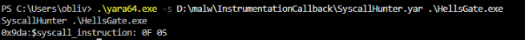
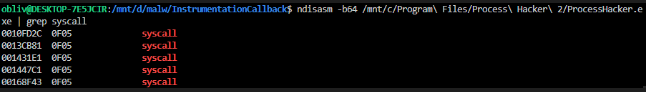
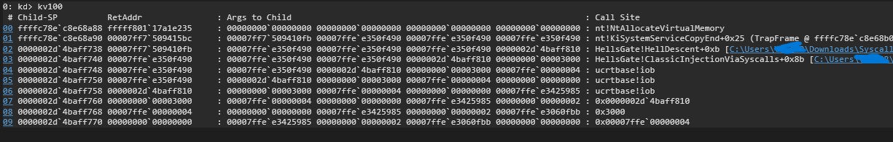
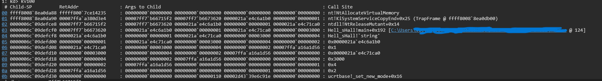
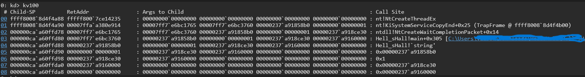

In this blog post, we’ll focus on the topic of _direct/indirect syscall_. I won’t go into detail about how a _syscall_ works or the _hooking_ mechanism. If you're not familiar with the topic, you can check out my previous posts on [hooking](https://oblivion-malware.xyz/posts/edr-archtecture/#hooked-flow-openprocess) and [direct syscall](https://oblivion-malware.xyz/posts/direct-syscall/).

This technique, for quite some time, has been (and still is) capable of executing APIs in a stealthy manner against some EDRs that rely on userland hooking, often allowing them to be bypassed.

Here, I’ll share my perspective on how this can be detected, present several alternatives, and highlight some of its weaknesses. We'll discuss it from a static analysis point of view, as well as InstrumentationCallback, Guard Page + VEH, Call Stack, and ETW-TI.

## Static
The simplest method would be to search for the syscall instruction within the analyzed code using YARA. Here's an example rule:
```c
rule SyscallHunter {
    meta:
        description = "Detecting syscall instruction in code"
        author      = "@ Oblivion"
        date        = "2025-04-02"
        reference   = "https://oblivion-malware.xyz"  

    strings:  
        $syscall_instruction = { 0F 05 }

    condition:
        any of ( $syscall_instruction* )  
}
```
Result when using it on a sample that implements HellsGate:


This could be bypassed by the attacker obfuscating the instruction, deobfuscating it at runtime, executing it, and then obfuscating it again. However, this approach is not commonly used. In most cases, the rule alone would already be sufficient for detection. Still, a defender could mitigate this technique, although it would require some effort. Another point is that this could lead to many false positives, since it's not an uncommon byte sequence.

For static analysis, it's more effective to use a disassembler and then perform a "grep" for the syscall instruction, as demonstrated below:



## InstrumentationCallback
We can configure the return address of the syscall to wherever we want and determine where it’s being invoked from. If it originates from a memory region belonging to a DLL like win32u, ntdll, or others, it’s typically considered non-malicious. Otherwise, it’s flagged as malicious. We can also analyze its parameters to better understand what’s happening, along with the full call stack. Below is an example of how to enable/configure this:

```cpp
    LONG    Status         = STATUS_SUCCESS;
    HANDLE  ProcessHandle  = ::GetCurrentProcess();

    PROCESS_INSTRUMENTATION_CALLBACK_INFORMATION InstCallbackInfo = { 0 };
  
    InstCallbackInfo.Callback = CallbackFunction;
    InstCallbackInfo.Reserved = 0;
    InstCallbackInfo.Version  = 0;

    Status = ::NtSetInformationProcess(
        ProcessHandle, (PROCESS_INFORMATION_CLASS)ProcessInstrumentationCallback,
        (PVOID)&InstCallbackInfo, sizeof( InstCallbackInfo )
    );
    if ( Status != STATUS_SUCCESS ) return;
```
One option for the attacker is to use the same approach but pass NULL in InstCallbackInfo.Callback = CallbackFunction;. We have an example of this behavior with SentinelOne EDR—it sets an InstrumentationCallback in addition to hooking certain functions. I’ll demonstrate when and how this happens in its implementation. First, we have the following code snippet running in x64dbg on a machine with SentinelOne installed:
```cpp
auto WINAPI WinMain(
    _In_ HINSTANCE Instance,
    _In_ HINSTANCE PrevInstance,
    _In_ PCHAR     CommandLine,
    _In_ INT       ShowCmd
) -> INT {
    NTSTATUS NTAPI ( *NtSetInformationProcess )( _In_ HANDLE ProcessHandle, _In_ PROCESS_INFORMATION_CLASS ProcessInformationClass, _In_ PVOID ProcessInformation, _In_ ULONG ProcessInformationLength );
    NtSetInformationProcess = ( decltype( NtSetInformationProcess ) )::GetProcAddress( ::GetModuleHandleA( "ntdll.dll" ), "NtSetInformationProcess" );

    LONG    Status         = STATUS_SUCCESS;
    HANDLE  ProcessHandle  = ::GetCurrentProcess();

    PROCESS_INSTRUMENTATION_CALLBACK_INFORMATION InstCallbackInfo = { 0 };

    InstCallbackInfo.Callback = NULL;
    InstCallbackInfo.Reserved = 0;
    InstCallbackInfo.Version  = 0;

    ::VirtualAlloc( 0, 1000, 0x3000, 0x40 );

    Status = ::NtSetInformationProcess(
        ProcessHandle, (PROCESS_INFORMATION_CLASS)ProcessInstrumentationCallback,
        (PVOID)&InstCallbackInfo, sizeof( InstCallbackInfo )
    );
    if ( Status != STATUS_SUCCESS ) return;

    ::VirtualAlloc( 0, 1000, 0x3000, 0x40 );
}
```
I overwrite the callback, effectively removing the one previously added by SentinelOne. Before doing that, I use `kernel32!VirtualAlloc` just to demonstrate its execution with the callback still active. Then, I call `kernel32!VirtualAlloc` again after removing the callback to show that it’s no longer in effect. Below is a demonstration video:  
[video]  
As we can see, we’re able to remove it without any issues—even though the `ntdll!NtSetInformationProcess` API is hooked. For some reason, SentinelOne allows its callback to be removed right under its nose.


## Call Stack
An approach I find quite effective is call stack analysis—Elastic EDR has been focusing on this method for quite some time. You can find a great write-up [here](https://www.elastic.co/security-labs/peeling-back-the-curtain-with-call-stacks). It’s very efficient for detecting shellcode execution in memory, especially when paying close attention to unbacked private memory regions with execution permissions being used by certain APIs.

For detecting direct syscalls, our main focus should be on the return address—specifically checking whether the caller into the kernel originates from a legitimate DLL such as `ntdll`, `win32u`, or others that contain syscall stubs, rather than from an executable. See the example below:



Above, we can see an execution of `ntdll!NtAllocateVirtualMemory` coming directly from the "HellsGate" executable, rather than through a Microsoft DLL as would normally be expected. This is already a strong indicator of direct syscall execution.

Now let’s take a look at an indirect syscall, paying closer attention to API "spoofing." What happens in some approaches is that the attacker sets the SSN (System Service Number) of the desired function and then performs a `jmp` into the memory space of another API, jumping directly to the *syscall* instruction. When this is done, we get a call stack like the following:

- `ntdll!NtAllocateVirtualMemory`



- `ntdll!NtCreateThreadEx`



As we can observe, it's quite easy to identify that API spoofing is happening—because in the case of `ntdll!NtCreateWaitCompletionPacket`, we actually see `ntdll!NtAllocateVirtualMemory` being executed in the kernel. This mismatch is a clear indicator of spoofing.

Using Elastic, we can create a detection rule based on these observations:
[rule]

## Page Guard + VEH
We implemented a hooking technique that differs from the conventional method, which usually involves overwriting the API with an unconditional jump (`jmp`). In our case, we add a vectored exception handler (VEH) and force an exception at the point where we want the hook to be triggered.

When the function is invoked and the exception is raised, we inspect the origin of the exception:

- If it originated from the base address of the function, we can treat it as a legitimate syscall.
- If the exception is triggered at the `syscall` instruction, we know there was a jump directly to that instruction, bypassing the routine responsible for setting up the syscall number (SSN).

To start, we change the memory protection of the functions we want to hook to `PAGE_EXECUTE_READ | PAGE_GUARD`.

```cpp
auto Instance::SetGuardPageProt(
    _In_ PVOID Address,
    _In_ ULONG Size
) -> BOOL {
    ULONG OldProt = 0;

    return ::VirtualProtect( Address, Size, PAGE_EXECUTE_READ | PAGE_GUARD, &OldProt );
}
```
We’ll create a structure and instantiate it globally.
```cpp
typedef struct {
    PVOID FuncPtr;
    PCHAR FuncName;
} HOOK, *PHOOK;

HOOK HookMgmt[FN_C] = { 0 };
```
Next, we’ll set the value of `FuncName` and loop through to retrieve the function’s address, changing its memory protection accordingly.
```cpp
    HookMgmt[0].FuncName = {FUNC_OF_YOUR_CHOICE};
    HookMgmt[1].FuncName = {FUNC_OF_YOUR_CHOICE};
    HookMgmt[2].FuncName = {FUNC_OF_YOUR_CHOICE};
    HookMgmt[3].FuncName = {FUNC_OF_YOUR_CHOICE};
    HookMgmt[4].FuncName = {FUNC_OF_YOUR_CHOICE};
    
    for ( INT i = 0; i < sizeof( HookMgmt ); i++ ) {
        HookMgmt[i].FuncPtr = (PVOID)::GetProcAddress( (HMODULE)NtdllPtr, HookMgmt[i].FuncName );
    }

    for ( INT i = 0; i < sizeof( HookMgmt ); i++ ) {
        if ( !( Instance::SetGuardPageProt( HookMgmt[i].FuncPtr, SYS_STUB_LENGTH ) ) ) {

            mPrint( "error changing hook functions memory protection to page guard" );  return ::GetLastError();
        }

        mPrint( "# %d set page guard protection to %s at %p", i, HookMgmt[i].FuncName, HookMgmt[i].FuncPtr );
    }
```

I was a bit lazy to parse the exception directory and retrieve the start and end addresses of an API, so I just grabbed the value directly using WinDbg:

![[Pasted image 20250404202531.png]]

## ETW-TI + Kernel Callbacks
I’ve already covered ETW-TI in a previous blog post [link], but to summarize: it’s a mechanism that logs events from within the kernel, which makes it significantly harder to bypass—unlike standard ETW, which operates in userland and runs within ntdll.dll.

ETW-TI provides various keywords that we can use as a secure form of telemetry. Unlike userland solutions like hooking, this method offers more reliable and tamper-resistant visibility. Here's a list of the two keyword sets: https://github.com/jdu2600/Windows10EtwEvents/blob/main/manifest/Microsoft-Windows-Threat-Intelligence.tsv. With these, we’re able to:

## Epilogue
