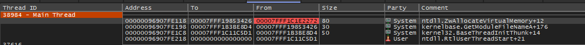

# Overview

[**Kharon**](https://github.com/entropy-z/Kharon) provides a range of advanced post-exploitation capabilities that allow the operator to execute actions in an evasive way. The core functionality is implemented directly in the agent, while additional features are delivered in-memory via **stagers** using **BOFs**. Later, these will migrate to **shellcode** when using **Fork & Run**.

The agent is highly flexible, and most of its behavior can be configured at runtime using the Config command. It is implemented entirely as shellcode with mordern design, without relying on sRDI, making it easier to use during injection.

---

# Motivation
I decided to start building my own agent because I consider Mythic to be one of the best free C2 frameworks available. However, I couldn't find many agents for Windows that offered advanced post-exploitation and evasion capabilities.

So, I took the opportunity to write my own—both to fill that gap and to consolidate my knowledge into a more complex and meaningful project.

---

# Supported Profiles

- HTTP/S  
- SMB

---

# Key Features

- Unmanaged PowerShell execution **without** using `Invoke-Expression`, powered by a custom .NET implementation.
- Lateral movement modules.
- In-memory .NET execution, tested against **CrowdStrike**, **SentinelOne**, **Elastic**, and **Microsoft Defender for Endpoint**.

  

  

- Shellcode execution in memory, with configurable behavior through runtime options.
- Process creation with **PPID spoofing** and output recovery.
- Screenshot capability. Demo


- Communication is encrypted using **Loky**, with encryption keys protected using **process cookies**.
- Token manipulation.
- Kerberos interaction (via [Kerbeus-BOF](https://github.com/RalfHacker/Kerbeus-BOF) by [Ralf](https://github.com/RalfHacker)).
- Interaction with **SCM** and **Windows Registry**.

---

# Evasion Techniques

- **Hardware breakpoints** for AMSI/ETW bypass during .NET and PowerShell memory execution.
Set breakpoint in the ``AmsiScanBuffer`` and ``NtTraceEvent``. You can see code [here](https://github.com/entropy-z/Injection-BOFs)
- **Call Stack Spoofing** to evade stack tracing detection.
NtAllocateVirtualMemory call stack example with spoof and indirect syscall:

- **Sleep Obfuscation** to conceal beacon activity in memory.
- **Heap Obfuscation** during sleep (heap allocations are XOR-obfuscated).
- **Stack Duplication** during sleep.
- **Indirect Syscalls**.
- **BOF API Hooking**, configurable per execution.

### Supported Beacon APIs
```text
BeaconDataParse  
BeaconDataInt  
BeaconDataExtract  
BeaconDataShort  
BeaconDataLength  
BeaconOutput  
BeaconPrintf  
BeaconAddValue  
BeaconGetValue  
BeaconRemoveValue  
BeaconVirtualAlloc  
BeaconVirtualProtect  
BeaconVirtualAllocEx  
BeaconVirtualProtectEx  
BeaconIsAdmin  
BeaconUseToken  
BeaconRevertToken  
BeaconOpenProcess  
BeaconOpenThread  
BeaconFormatAlloc  
BeaconFormatAppend  
BeaconFormatFree  
BeaconFormatInt  
BeaconFormatPrintf  
BeaconFormatReset  
BeaconWriteAPC  
BeaconDripAlloc
```

## Supported Hooked API Table | Indirect Syscall | Spoof
```text
VirtualAlloc  
VirtualProtect  
WriteProcessMemory  
ReadProcessMemory  
LoadLibraryA  
VirtualAllocEx  
VirtualProtectEx  
NtSetContextThread  
SetThreadContext  
MtGetContextThread  
GetThreadContext  
CLRCreateInstance  
CoInitialize  
CoInitializeEx
```


---

# Lateral Movement

Remote execution is supported via:

- **WMI** (using COM)
- **WinRM** (using COM)
- **SCM** (similar to PsExec behavior)

---

# Alternate Behavior via `Config` Command

The `Config` command allows customization of runtime behavior, including:

- `killdate`  
- `ppid` to spoof  
- Allocation method: `DripAlloc` or `Default`  
- Write method: `WriteAPC` or `Default`  
- Call stack spoof toggle  
- Sleep obfuscation method: `None (WaitForSingleObject)` or `Timer`  
- BOF API hooking options  
- Sleep Time
- Sleep Jitter
- Exit method `Process or Thread`


---

# Getting Started

This section will be expanded with a detailed guide on how to build and operate the agent.

## Build

Below is the screen showing the available build options:  


Options starting with **0.*** are applied to both the loader of the agent and the agent.  
Options starting with **1.*** are applied only to the agent.

## Agent Options

- **1.0 Memory Obfuscation**  
  Choose the method to obfuscate memory during sleep.  
  **Options:** `None`, `Timer`

- **1.1 Heap Obfuscation**  
  If enabled, all heap allocations will be obfuscated using XOR.

- **1.2 Indirect Syscalls**  
  If enabled, the beacon will use indirect syscalls.

- **1.3 Hardware Breakpoints**  
  Uses HWBP to bypass AMSI/ETW depending on your configuration.

- **1.4 Spoof Call Stack**  
  Spoofs the call stack to evade stack-based detection.

- **1.5 Beacon Object File (BOF) Hooks**  
  Enables API call hooks for BOFs.

- **1.6 Shellcode Injection**  
  Choose the preferred technique for shellcode injection.

- **1.7 Self-Deletion in Kill Date Routine**  
  Allows the beacon to delete itself during the kill date routine.

- **1.8 Kill Date Option**  
  Set a date for the agent to stop running.

- **1.9 Exit Method**  
  Defines how the agent exits during the kill date routine.  
  **Options:** `Thread`, `Process`


---

# Planned Features

- Support for JScript, VBS, and XSL in memory execution 
- SOCKS proxy integration
- Argument Spoofing for Process creation.
- Improved .NET execution with output redirection for better performance
- Enhance Unmanaged PowerShell execution to eliminate dependency on in-memory .NET
- PE in-memory execution with IAT hooking
- Shellcode injection via Fork & Run
- Working hours scheduling
- Loader with advanced features (stager options, anti-analysis, evasion, etc.)
- Module stomping option for shellcode injection
- Keylogger


---

